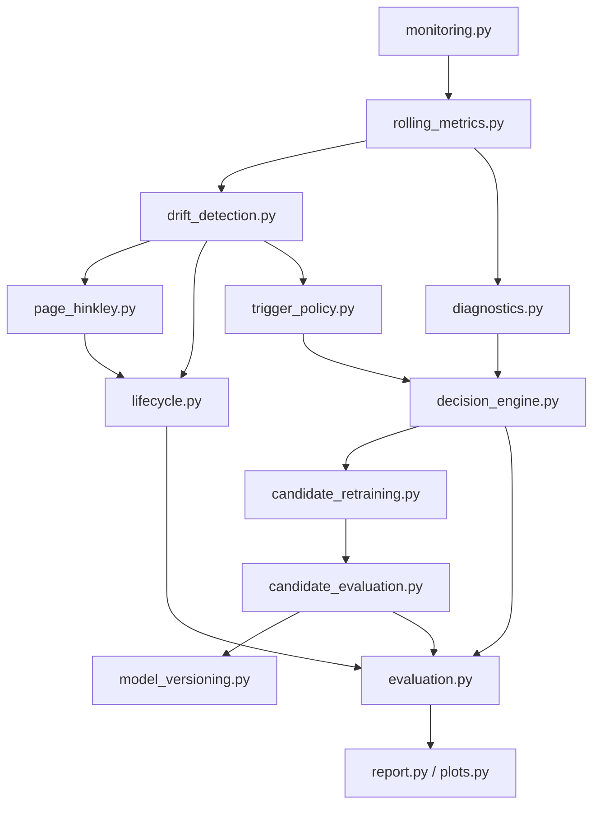

# Module Interactions

AFMLF separates **detection**, **diagnosis**, **decision**, and **execution** into independent modules. `pipeline.py` orchestrates them in walk-forward order.

## Data flow

## Per-origin loop

At each walk-forward origin:

1. **monitoring** — forecast Day-1 Hybrid and Prophet; compute MAE/RMSE.
2. **rolling_metrics** — update rolling windows per container.
3. **drift_detection** — compare rolling Hybrid MAE to frozen per-container baseline.
4. **page_hinkley** — optional confirmatory test on error stream.
5. **lifecycle** — advance container states (Stable → Warning → …).
6. **diagnostics** — classify Prophet vs Hybrid error patterns.
7. **trigger_policy** — cohort-level fraction/median trigger.
8. **decision_engine** — `recommend_retraining` | `do_not_retrain` | `needs_investigation`.
9. **candidate_retraining** — train Hybrid vN offline (if recommended).
10. **candidate_evaluation** — compare candidate vs incumbent on **future** origins only.
11. **model_versioning** — register artifact metadata; emit deployment recommendation.

## Read-only dependencies

| Module | Reads from (frozen) |
|--------|---------------------|
| `candidate_retraining` | `production.utils.training.train_production_hybrid` |
| `monitoring` | `utils.hybrid_inference`, incumbent GRU weights |
| `drift_detection` | `baseline_reference` evaluation CSV |

Nothing in AFMLF writes to production, forecast service, or prior experiment folders.
