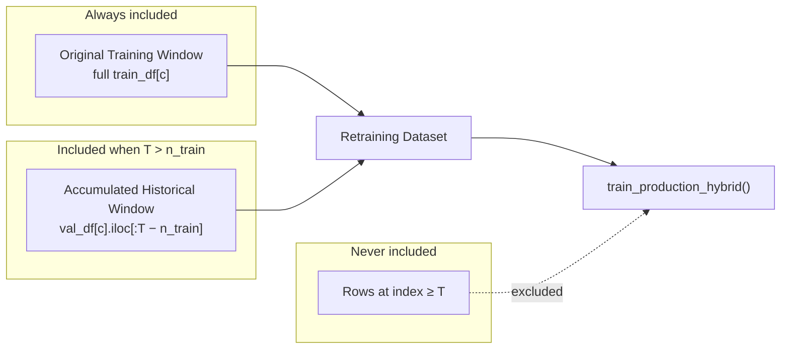

# Candidate Retraining Methodology

**Module:** `utils/adaptive_lifecycle/candidate_retraining.py`  
**Status:** Approved methodology for AFMLF offline candidate retraining (post-validation correction, July 2026)

This document is suitable for direct inclusion in the thesis methods chapter.

---

## 1. Motivation

Hybrid Prophet+GRU (`hybrid_v1`) is trained once on a fixed **original offline training dataset** (`train_df`, ~80% per container) and deployed to production. After deployment, new CPU observations accumulate. When AFMLF detects concept drift and recommends retraining, the candidate model must be trained under **equivalent conditions** to the incumbent: the full original offline corpus **plus** legitimately observed history — never future data.

The initial AFMLF implementation used a chronological **prefix** of `concat(train, val)`, which at early triggers (e.g. T = 200) produced ~200 rows per container while the incumbent was trained on ~614. That confounded drift adaptation with training-set size. The corrected methodology resolves this.

---

## 2. Original production training (incumbent)

| Aspect | Policy |
|--------|--------|
| Data | `data/train_df.parquet` only (per-container 80% temporal split) |
| Containers | 99-container AFMLF cohort (from baseline reference evaluation) |
| Scaling | MinMaxScaler fit on each container's **train portion**; stored in frozen preprocessing |
| Prophet | Per-container fit on train rows inside `generate_prophet_residuals` |
| GRU | Global model on residual sequences from all cohort containers |
| Artifact | `hybrid_v1` (copied from baseline reference in AFMLF experiments) |

The original offline training window is **immutable**. It represents the batch corpus available at initial deployment.

---

## 3. Candidate retraining (Hybrid v2, v3, …)

| Aspect | Policy |
|--------|--------|
| Trigger | Cohort-level `recommend_retraining` decision at walk-forward origin **T** |
| Scope | **Cohort-global** — all containers in the AFMLF cohort (global GRU design) |
| Architecture | Unchanged — `train_production_hybrid()` (same Prophet + GRU pipeline) |
| Output | `experiments/.../versions/hybrid_vN/` — never overwrites production |

---

## 4. Training dataset construction

### 4.1 Windows (definitions)

```
Unified per-container timeline (chronological):

|-- Original Training Window --|-- Accumulated Historical Window --| trigger T | future (excluded) |
[0 ............... n_train-1]  [n_train ............... T-1]        ^           eval only

Original Training Window     = full train_df[c]  (always included, all n_train rows)
Accumulated Historical Window = val_df[c] rows with unified index in [n_train, T)
Retraining Dataset           = Original Training Window ∪ Accumulated Historical Window
```

**Row counts:**

```
n_accumulated_val = 0                          if T ≤ n_train
n_accumulated_val = min(len(val_df[c]), T − n_train)   if T > n_train

n_total = n_train + n_accumulated_val
```

At pilot trigger **T = 200** with **n_train ≈ 614**: no validation rows qualify → candidate uses **full original train only** (614 rows/container), matching incumbent training volume.

At **T = 700**: candidate uses 614 train + 86 val rows = 700 rows (indices 0–699, strictly before T).

### 4.2 Diagram



### 4.3 Implementation

```python
train_part = train_df[cid]                    # full original offline train
n_val_take = accumulated_val_row_count(T, n_train, len(val_part))
val_accumulated = val_part.iloc[:n_val_take]  # post-train observations before T
train_frame = concat(train_part, val_accumulated)
# cpu_scaled taken from frozen parquet — no scaler refit
```

---

## 5. Scaler policy

**Policy: reuse frozen production `cpu_scaled` from parquet.**

| Rationale | Detail |
|-----------|--------|
| Consistency with incumbent | Incumbent preprocessing fit scalers on original train only and applied them to val |
| Available in artifacts | `train_df` and `val_df` already contain `cpu_scaled`, `cpu_mean`, etc. |
| Avoid distribution shift | Refitting MinMax on a prefix or mixed window changes the input scale vs production |

New validation rows in the accumulated window were **transformed** with the original train-fitted scaler during frozen preprocessing — the same rule production uses. Candidate retraining does **not** refit scalers.

---

## 6. Temporal constraints and leakage prevention

### Training

| Rule | Enforcement |
|------|-------------|
| Full original train always preserved | `train_part = train_df[cid]` (complete partition) |
| Accumulated val strictly before T | `n_val_take = min(len(val), max(0, T − n_train))` |
| No rows at or after trigger in accumulated val | `assert n_train + n_accumulated ≤ T` when `n_accumulated > 0` |
| Expected val count | `assert_retraining_temporal_integrity()` in `candidate_retraining.py` |

**Note:** When T ≤ n_train, the original offline train (length n_train > T) is included in full. This is intentional: it is the frozen deployment corpus, not "future" monitoring data. Only the **accumulated historical window** (val rows) is time-filtered by T.

### Evaluation

| Rule | Enforcement |
|------|-------------|
| Eval origins strictly after trigger | `assert origin_index > trigger_origin_index` |
| Eval warmup gap | `origin_index ≥ T + eval_warmup_origins × stride` |
| Forecast history | `forecast_at_origin` uses `iloc[:origin_index]` only |

Candidate evaluation is unchanged by this correction — it always used future origins correctly.

---

## 7. Why original training data is preserved

1. **Production realism** — offline retraining in industry retains the original batch training set and appends new telemetry.
2. **Fair comparison** — incumbent and candidate both start from the same original offline corpus; differences reflect new observations and retraining, not reduced history.
3. **Global GRU stability** — the shared GRU requires representative cohort data; discarding most of the original train at early triggers destabilized sequence counts.

---

## 8. Why new observations are appended (not prefix-truncated)

Post-deployment observations live in the validation-period timeline (`val_df`) in this simulation. Appending `val_df` rows before T models **accumulated operational history** after the original training period. Prefix truncation from t = 0 incorrectly discarded most of the original offline corpus at early triggers.

---

## 9. Why future observations are excluded

Rows at unified index ≥ T are excluded from candidate training. These are the trigger point and beyond — they may be used only for **evaluation** (at origins > T + warmup) or subsequent monitoring. Including them would leak the drift-detection context into retraining and invalidate deployment recommendations.

---

## 10. Relation to AFMLF lifecycle

```
Drift confirmed → Decision: recommend_retraining
        ↓
Build retraining dataset (this document)
        ↓
train_production_hybrid → hybrid_vN
        ↓
Evaluate on future origins → deployment recommendation
        ↓
Human gate (never auto-deploy)
```

Monitoring, drift detection, diagnostics, and decision logic are unchanged. Only dataset assembly in `candidate_retraining.py` was corrected.
