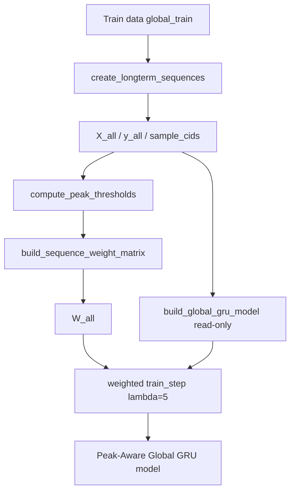

# Stage 2 — Implementation Record (Peak-Aware Global GRU)

[← Design Lock](01-design-lock.md) · [Stage 2 Plan](stage-02-implementation-plan.md) · [Study Overview](README.md)

**Status:** Complete  
**Locked date:** 2026-07-17  
**Training run:** `experiments/peak_aware_global_2026-07-17_164737/`  
**Lock record:** `experiments/peak_aware_global_2026-07-17_164737/phase2_implementation.json`  
**Design authority:** `experiments/peak_aware_global_design_2026-07-17/design_lock.json`  
**Control reference:** `experiments/global_gru_reference_2026-07-17/`

---

## 1. Objective

Implement the locked Stage 1 design as parallel modules and scripts. Train the Peak-Aware Global GRU model, save experiment artifacts, pass **10/10 fairness checks**, and lock the implementation record — **without** modifying the frozen Global baseline or running Stage 3 evaluation.

---

## 2. Implementation Workflow

```
Train data (global_train — 99 containers)
        ↓
create_longterm_sequences()
        ↓
X_all / y_all / sample_cids          ← identical to frozen Global baseline
        ↓
compute_peak_thresholds()            ← P90, train-only, per-container
        ↓
build_sequence_weight_matrix()
        ↓
W_all                                ← only new training tensor
        ↓
build_global_gru_model()             ← read-only from utils.global_training
        ↓
weighted train_step (λ = 5)          ← single behavioural change
        ↓
Peak-Aware Global GRU model
```



---

## 3. Task Plan

| Task | Focus | Status |
|------|-------|--------|
| 1 | Workspace + `global_peak_aware_config.py` | **Complete** |
| 2 | Extend `peak_detection.py` + sanity checks | **Complete** |
| 3 | `global_training_peak_aware.py` | **Complete** |
| 4 | Experiment runner + smoke run | **Complete** |
| 5 | `verify_peak_aware_global_fairness.py` (10 checks) | **Complete** |
| 6 | Full training run + reference snapshot | **Complete** |
| 7 | Implementation lock record | **Complete** |

**Implementation workspace:** `experiments/peak_aware_global_implementation_2026-07-17/`

---

## 4. What Was Built

| Component | Path | Role |
|-----------|------|------|
| Configuration | `utils/global_peak_aware_config.py` | Treatment constants; read-only imports from `global_config` + `peak_config` |
| Peak detection (extended) | `utils/peak_detection.py` | Added `align_with_longterm_sequences()`; shared P90 / `W_all` logic |
| Peak-aware training | `utils/global_training_peak_aware.py` | Weighted pipeline; reuses `build_global_gru_model()` read-only |
| Peak sanity runner | `scripts/run_peak_aware_global_peak_detection_sanity.py` | Task 2 validation JSON |
| Experiment runner | `scripts/run_peak_aware_global_experiment.py` | Full training + artifact save |
| Fairness gate | `scripts/verify_peak_aware_global_fairness.py` | 10 pre-evaluation checks |

Frozen Global baseline modules (`utils/global_*.py`, `sequence_utils.py`, `models/global_gru.keras`) were imported read-only only.

---

## 5. Single Experimental Variable

Everything except GRU training loss is identical to the frozen Global GRU baseline:

| Unchanged | Changed |
|-----------|---------|
| `create_longterm_sequences()` → N = 41,650 | Train loss: timestep-weighted MSE |
| Features `(cpu_scaled, cpu_mean, cpu_std)` | Peak timesteps weighted λ = 5, others 1.0 |
| `build_global_gru_model()` architecture | Custom `train_step` (2D `sample_weight`) |
| Optimizer, batch 256, shuffle False, seed 42 | `sample_weight=W_train` on train only |
| Early stopping on unweighted `val_loss`, patience 3 | — |
| Global inference / evaluation path | — |

---

## 6. Training Outcome (Primary Run)

| Item | Value |
|------|-------|
| Experiment ID | `peak_aware_global_2026-07-17_164737` |
| Model | `models/global_gru_peak_aware.keras` |
| Trained at | 2026-07-17T11:18:01Z |
| Epochs run | **4** / 50 max (early stopping) |
| Final train loss (weighted MSE) | **0.0317** |
| Final val loss (unweighted) | **0.0406** |
| Final train MAE | 0.118 |
| Final val MAE | 0.144 |
| Peak-weight fraction | **16.94%** of forecast timesteps |
| Sequence counts | 41,650 total; 33,320 train; 8,330 val |
| Peak thresholds | 99 containers |

**Smoke run (development only):** `experiments/peak_aware_global_2026-07-17_163737/` (2 epochs). Primary locked run is `_164737`.

---

## 7. Fairness Verification

**Record:** `verification/fairness_check.json`  
**Verified at:** 2026-07-17T11:18:24Z  
**Result:** **10/10 PASS**

| # | Check | Result |
|---|-------|--------|
| 1 | Frozen file integrity | PASS |
| 2 | Identical `X_all`, `y_all`, sample ordering | PASS |
| 3 | `W_all` only allowed difference | PASS |
| 4 | Architecture via `build_global_gru_model` | PASS |
| 5 | Hyperparams match `baseline_metadata.json` | PASS |
| 6 | Unweighted early stopping | PASS |
| 7 | Shared Global inference/evaluation path | PASS |
| 8 | Valid P90 peak threshold artifact | PASS |
| 9 | Weight matrix aligns with longterm sequences | PASS |
| 10 | Single behavioural difference (weighted train step only) | PASS |

---

## 8. Baseline Integrity

| Item | Status |
|------|--------|
| `utils/global_*.py` unmodified | Confirmed |
| `utils/sequence_utils.py` unmodified | Confirmed |
| `models/global_gru.keras` unmodified | Confirmed |
| `experiments/global_gru_reference_2026-07-17/` unmodified | Confirmed |
| Production paths not written by treatment code | Confirmed (check #1) |

---

## 9. Artifacts (Primary Run)

| Artifact | Relative path |
|----------|---------------|
| Model | `models/global_gru_peak_aware.keras` |
| Model metadata | `models/global_gru_peak_aware_metadata.json` |
| Peak thresholds | `peak/peak_thresholds.pkl` |
| Peak config | `peak/peak_config.json` |
| Training metadata | `training/training_metadata.json` |
| Reference snapshot | `reference/reference_metadata.json` |
| Fairness check | `verification/fairness_check.json` |
| Experiment metadata | `experiment_metadata.json` |

---

## 10. Task Notes

### Task 1 — Configuration

- Created `utils/global_peak_aware_config.py` (Option B — separate from frozen `global_config.py`).
- Workspace: `experiments/peak_aware_global_implementation_2026-07-17/`.

### Task 2 — Peak detection extension

- Added `align_with_longterm_sequences()` to shared `peak_detection.py`.
- Sanity: `peak_detection_sanity.json` — N = 41,650, peak fraction 16.94%, CID alignment true.

### Task 3 — Training module

- `train_global_gru_peak_aware()` mirrors Hybrid weighted pipeline for direct CPU forecasting.
- Reuses `build_global_gru_model()` and `set_random_seeds()` read-only.

### Task 4 — Smoke experiment

- Smoke dir: `experiments/peak_aware_global_2026-07-17_163737/` (2 epochs).
- Verified artifact layout and model reload.

### Task 5 — Fairness verifier

- 10 checks implemented; smoke run validated script (10/10 PASS).

### Task 6 — Full training

- Primary dir: `experiments/peak_aware_global_2026-07-17_164737/`.
- Reference snapshot saved; full run fairness 10/10 PASS.

---

## 11. Exit Criteria (Stage 2 Complete)

- [x] All new modules and scripts implemented
- [x] `align_with_longterm_sequences()` added without Hybrid regression
- [x] `build_global_gru_model()` reused read-only — no duplicate architecture
- [x] Peak-Aware Global model trained and saved (primary run)
- [x] `peak_thresholds.pkl`, `peak_config.json`, `training_metadata.json`, `reference/reference_metadata.json` saved
- [x] Identical `X_all`, `y_all`, ordering; only `W_all` differs
- [x] **All 10 fairness checks PASS** (primary run)
- [x] Frozen Global baseline unmodified
- [x] Stage 3 evaluation **not** started

---

## 12. Stage 3 Handoff (Pending Approval)

| Item | Value |
|------|-------|
| Evaluation plan | [stage-03-evaluation-plan.md](stage-03-evaluation-plan.md) |
| Control reference | `experiments/global_gru_reference_2026-07-17/` |
| Treatment artifacts | `experiments/peak_aware_global_2026-07-17_164737/` |
| Inference | `utils/global_inference.run_global_inference` (unchanged) |
| Evaluation | `utils/global_evaluation.evaluate_selected_containers` (unchanged) |
| Peak metrics | Extend `utils/peak_evaluation.py` for Global (`day1_pred_real`) |
| Delta convention | treatment − control |

**Do not start Stage 3 until explicitly approved.**
