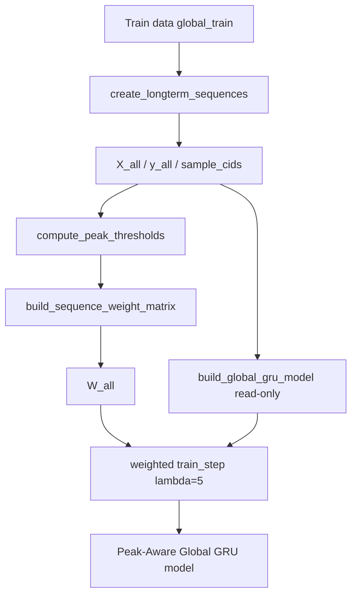

# Stage 2 — Implementation + Fairness Verification (Task Plan)

[← Design Lock](01-design-lock.md) · [Study Overview](README.md)

**Status:** Complete (2026-07-17)  
**Implementation record:** [02-implementation-record.md](02-implementation-record.md)  
**Lock artifact:** `experiments/peak_aware_global_2026-07-17_164737/phase2_implementation.json`

---

## 1. Objective

Implement the locked Stage 1 design as parallel modules, train Peak-Aware Global GRU once (λ = 5), save artifacts, and pass **all 10 fairness checks** — without modifying frozen Global baseline code and **without** running Stage 3 evaluation.

---

## 2. Stage 2 Constraints

| Constraint | Rule |
|------------|------|
| Frozen baseline | Do **not** modify `utils/global_*.py`, `sequence_utils.py`, `notebooks/global_gru_model.ipynb`, `models/global_gru.*`, or `global_gru_reference/` |
| Architecture | **Reuse** frozen `build_global_gru_model()` from `utils/global_training.py` (read-only import) — do not duplicate layer definitions |
| Shared peak module | May **extend** `utils/peak_detection.py` (backward-compatible) |
| Imports | Read-only from frozen modules |
| Outputs | Save only under `experiments/peak_aware_global_<timestamp>/` |
| Evaluation | Do **not** run Stage 3 metrics, comparison tables, or plots |
| Design changes | Do **not** change λ, P90, mechanism, hyperparams, or architecture without approval |

---

## 3. Architecture Builder Policy

**Preferred approach (mandatory unless technically blocked):**

- Import and call `build_global_gru_model()` from frozen `utils/global_training.py`.
- Keep the GRU layer definition in **one place** only.
- Peak-Aware Global replaces **only** the training procedure (`weighted train_step` + `sample_weight=W_train` on fit).
- Do **not** copy or reimplement layer definitions in `global_training_peak_aware.py`.

**If reuse is impossible** (e.g. import side effects that mutate global state), document the technical reason in `02-implementation-record.md` **before** creating any duplicate architecture code. The resulting model config must still be provably identical to the reference (check #4 and #10).

---

## 4. Task Dependency Flow

```
Task 1 (config + workspace)
    ↓
Task 2 (peak_detection extension + sanity)
    ↓
Task 3 (peak-aware training module — reuses build_global_gru_model)
    ↓
Task 4 (experiment runner + smoke train)
    ↓
Task 5 (fairness verification script — 10 checks)
    ↓
Task 6 (full training run + reference snapshot)
    ↓
Task 7 (Stage 2 lock record + workflow diagram)
```

---

## Task 1 — Workspace + Configuration Module

**Focus:** Create experiment workspace scaffold and `utils/global_peak_aware_config.py`.

### Purpose
Establish treatment-specific constants and paths without touching frozen `global_config.py`.

### Inputs
- Stage 1 design lock
- Frozen `utils/global_config.py` (read-only)
- Locked `utils/peak_config.py` (read-only, for shared P90/λ where identical)

### Deliverables

| Output | Description |
|--------|-------------|
| `utils/global_peak_aware_config.py` | Treatment config: `MODEL_VARIANT`, artifact filenames, experiment path helpers, read-only re-exports from `global_config` |
| `experiments/peak_aware_global_implementation_<date>/` | Workspace folder with `experiment_metadata.json` |

### Exit criteria
- [ ] Module imports successfully without modifying `global_config.py`
- [ ] All locked hyperparams match `baseline_metadata.json` (epochs 50, batch 256, ES patience 3, seed 42)
- [ ] Workspace metadata references design lock JSON

---

## Task 2 — Extend Shared Peak Detection + Sanity Checks

**Focus:** Add Global sequence alignment helper to `utils/peak_detection.py` and verify peak/weight logic.

### Purpose
Reuse architecture-independent peak logic; prove `W_all` aligns with `create_longterm_sequences()` before training code is written.

### Inputs
- `data/train_df.parquet`, `data/scalers.pkl`
- Existing: `compute_peak_thresholds`, `build_sequence_weight_matrix`, `label_peak_timesteps`
- Frozen `create_longterm_sequences`

### Deliverables

| Output | Description |
|--------|-------------|
| `align_with_longterm_sequences()` in `utils/peak_detection.py` | Verifies weight-matrix row order matches baseline sequence builder |
| Sanity JSON in workspace | Threshold generation, count, alignment, peak rate ~17%, `W_all` shape `(41650, 96)`, binary weights `{1.0, 5.0}` |

### Threshold validation (required)

| Check | Required |
|-------|----------|
| Threshold generation succeeds | Yes |
| Threshold count correct (per container) | Yes |
| Alignment with `create_longterm_sequences` succeeds | Yes |
| Peak rate reasonable (~17% of forecast timesteps) | Yes |
| Compare threshold values to Hybrid experiment | **No — out of scope** |

Peak thresholds derive from the same train data, scalers, and P90 definition. Cross-study threshold comparison adds no methodological value.

### Exit criteria
- [ ] `align_with_longterm_sequences()` returns `cid_arrays_equal: true`
- [ ] `W_all` shape and peak-rate sanity checks pass
- [ ] Existing Hybrid alignment helper still works (no regression)
- [ ] No separate `global_peak_detection.py` created

---

## Task 3 — Peak-Aware Global Training Module

**Focus:** Implement `utils/global_training_peak_aware.py`.

### Purpose
Full training pipeline: identical sequences to baseline, weighted loss on `y_train` only, **frozen architecture builder reused**.

### Inputs
- Task 1 config
- Task 2 peak detection helpers
- Frozen `build_global_gru_model` from `utils/global_training.py` (read-only)
- Weighted train-step pattern from `utils/hybrid_training_peak_aware.py`

### Deliverables

| Output | Description |
|--------|-------------|
| `utils/global_training_peak_aware.py` | Weighted training pipeline |
| `_weighted_train_step` + `_install_weighted_train_step` | Keras 2D sample_weight workaround |
| `train_global_gru_peak_aware()` | Main entry: sequences → thresholds → W_all → split → fit |

### Training protocol (locked steps)

1. Load `global_train`, scalers
2. `create_longterm_sequences()` → `X_all`, `y_all`, `sample_cids`
3. Assert `N == 41650`
4. `compute_peak_thresholds()` → thresholds
5. `build_sequence_weight_matrix()` → `W_all`
6. Assert alignment via `align_with_longterm_sequences()`
7. Assert binary weights; `W_all.shape == y_all.shape`
8. Split at `split_idx = int(len(X_all) * 0.8)` → train / val (no weights on val)
9. **`build_global_gru_model()` — read-only import from frozen `global_training`**
10. Compile with MSE; install weighted `train_step`
11. Fit with `sample_weight=W_train`; unweighted ES on `(X_val, y_val)`
12. Return `(model, training_metadata, peak_thresholds, W_all)`

### Single behavioural change

| Unchanged | Changed |
|-----------|---------|
| `create_longterm_sequences`, features, target, split | Train loss: timestep-weighted MSE |
| **`build_global_gru_model()` (imported, not duplicated)** | Custom `train_step` |
| Optimizer, epochs, batch, shuffle, seed, ES | `sample_weight=W_train` on train only |

### Exit criteria
- [ ] Module runs on 1–2 epoch smoke call without error
- [ ] Pre-train assertions all pass
- [ ] `build_global_gru_model` imported read-only — no duplicate layer definitions
- [ ] `training_metadata` records peak-aware loss type, λ, weight fraction
- [ ] No writes to frozen paths or production `models/`

---

## Task 4 — Experiment Runner + Smoke Training Run

**Focus:** Implement `scripts/run_peak_aware_global_experiment.py` and execute smoke train.

### Purpose
Orchestrate training and persist Stage 2 artifacts to a timestamped experiment directory.

### Deliverables

| Output | Description |
|--------|-------------|
| `scripts/run_peak_aware_global_experiment.py` | CLI: load data → train → save artifacts |
| `experiments/peak_aware_global_<timestamp>/` (smoke) | Partial artifact tree |

### Artifacts to save (full run)

```
models/global_gru_peak_aware.keras
models/global_gru_peak_aware_metadata.json
peak/peak_thresholds.pkl
peak/peak_config.json
training/training_metadata.json
experiment_metadata.json
```

### Smoke run
- `--epochs 2` or `--smoke` flag for pipeline validation
- Verify artifact paths, JSON schemas, model loadable

### Exit criteria
- [ ] Script runs end-to-end on smoke settings
- [ ] All expected directories/files under experiment dir only
- [ ] Model loads with `keras.models.load_model`
- [ ] No evaluation scripts invoked

---

## Task 5 — Fairness Verification Script (10 Checks)

**Focus:** Implement `scripts/verify_peak_aware_global_fairness.py`.

### Purpose
Hard gate before Stage 3: prove single-variable fairness contract is satisfied.

### Deliverables

| Output | Description |
|--------|-------------|
| `scripts/verify_peak_aware_global_fairness.py` | 10-check verification runner |
| `verification/fairness_check.json` | PASS/FAIL record per check |

### Mandatory checks

| # | Check | Detail |
|---|-------|--------|
| 1 | Frozen file integrity | Peak-aware sources contain no writes to frozen Global modules, reference dir, or production models |
| 2 | **Identical sequences (hard gate)** | `X_all`, `y_all`, `sample_cids` match baseline `create_longterm_sequences()` on same `global_train` |
| 3 | Sequence count | N = 41,650; N_train = 33,320; N_val = 8,330 |
| 4 | W_all only tensor difference | Shape `(41650, 96)`; values only `{1.0, 5.0}` |
| 5 | Architecture parity | Model from `build_global_gru_model()` matches reference metadata |
| 6 | Hyperparam parity | epochs 50, batch 256, ES patience 3, seed 42, shuffle False |
| 7 | Unweighted early stopping | Val fit uses no sample weights |
| 8 | Inference/eval path unchanged | Peak-aware code does not fork `global_inference` / `global_evaluation` |
| 9 | Valid peak thresholds | P90 artifact exists; threshold count correct; alignment helper passes |
| 10 | **Single behavioural difference** | Pipeline parity audit: identical optimizer, callbacks, batch size, epochs, shuffle, validation split, architecture builder, training data, sequence generation — **only** custom weighted `train_step` differs |

### Check #10 — Single behavioural difference (detail)

Compare Peak-Aware training pipeline against frozen `train_global_gru()` contract:

| Component | Must match baseline |
|-----------|---------------------|
| Optimizer | Adam |
| Callbacks | EarlyStopping on `val_loss`, patience 3, restore best weights |
| Batch size | 256 |
| Epochs max | 50 |
| Shuffle | False |
| Validation split | `split_idx = int(len(X_all) * 0.8)` |
| Architecture | `build_global_gru_model()` (same import) |
| Training data | `global_train` only |
| Sequence generation | `create_longterm_sequences()` same args |
| **Allowed difference** | `_install_weighted_train_step` + `sample_weight=W_train` on train fit |

Implementation approach: static source inspection + runtime metadata comparison against `baseline_metadata.json` and `training_metadata.json`.

### Exit criteria
- [ ] Script runs against smoke/full experiment dir
- [ ] Check #2 compares peak-aware path vs independent baseline recomputation
- [ ] Check #10 explicitly audits pipeline parity
- [ ] Exit code 0 = all 10 PASS

---

## Task 6 — Full Training Run + Reference Snapshot

**Focus:** Train production Peak-Aware Global model; save traceability snapshot; obtain 10/10 fairness PASS.

### Purpose
Produce locked treatment artifacts for Stage 3.

### Deliverables

| Output | Description |
|--------|-------------|
| `experiments/peak_aware_global_<timestamp>/` (full) | Complete artifact tree |
| `reference/reference_metadata.json` | Reproducibility snapshot (see below) |
| `verification/fairness_check.json` | **All 10 checks PASS** |

### Reference metadata snapshot

Save `reference/reference_metadata.json` inside the experiment directory:

```json
{
  "global_baseline_reference": "experiments/global_gru_reference_2026-07-17/",
  "baseline_version": "global_gru_v1",
  "design_lock_reference": "experiments/peak_aware_global_design_2026-07-17/design_lock.json",
  "implementation_version": "global_gru_peak_aware_v1",
  "frozen_control_path": "experiments/global_gru_reference_2026-07-17/models/global_gru.keras",
  "timestamp": "<ISO-8601 UTC>",
  "stage": 2,
  "fairness_checks_required": 10
}
```

### Run parameters
- Epochs max: **50** · ES patience: **3** · Batch: **256** · Seed: **42**

### Exit criteria
- [x] Full training completes
- [x] All artifacts saved per design lock layout
- [x] `reference/reference_metadata.json` written
- [x] `verify_peak_aware_global_fairness.py` → **10/10 PASS**
- [x] Frozen baseline files confirmed unmodified
- [x] Stage 3 **not** started

---

## Task 7 — Stage 2 Implementation Lock Record

**Focus:** Document what was built; include workflow diagram; lock Stage 2.

### Purpose
Auditable record for thesis and Stage 3 handoff.

### Deliverables

| Output | Description |
|--------|-------------|
| `docs/peak-aware-global/02-implementation-record.md` | Task-by-task log, training outcome, fairness summary, **workflow diagram** |
| `experiments/peak_aware_global_<timestamp>/phase2_implementation.json` | Machine-readable lock |
| README status update | Stage 2 → Complete |

### Implementation workflow diagram (required in `02-implementation-record.md`)

Documentation-only — for thesis readability:

```
Train data (global_train)
        ↓
create_longterm_sequences()
        ↓
X_all / y_all / sample_cids          ← identical to frozen Global baseline
        ↓
compute_peak_thresholds()            ← P90, train-only, per-container
        ↓
build_sequence_weight_matrix()
        ↓
W_all                                ← only new training tensor
        ↓
build_global_gru_model()             ← read-only from frozen global_training
        ↓
weighted train_step (λ=5)            ← single behavioural change
        ↓
Peak-Aware Global GRU model
```

Equivalent mermaid (optional in doc):



### Exit criteria
- [x] Documentation matches artifacts on disk
- [x] Workflow diagram included
- [x] `phase2_implementation.json` written
- [x] Stage 2 marked complete; Stage 3 gated on approval

---

## 5. Updated Experiment Layout (Stage 2 additions)

```
experiments/peak_aware_global_<timestamp>/
├── reference/
│   └── reference_metadata.json       ← Task 6 (new)
├── models/
├── peak/
├── training/
├── verification/
│   └── fairness_check.json           ← 10 checks
└── experiment_metadata.json
```

---

## 6. Task Summary

| Task | Focus | Key output | Gate |
|------|-------|------------|------|
| **1** | Config + workspace | `global_peak_aware_config.py` | Imports clean |
| **2** | Peak detection extension | `align_with_longterm_sequences()` + sanity | Alignment true |
| **3** | Training module | `global_training_peak_aware.py` (reuses `build_global_gru_model`) | Smoke callable |
| **4** | Experiment runner | `run_peak_aware_global_experiment.py` | Smoke artifacts |
| **5** | Fairness verifier | `verify_peak_aware_global_fairness.py` | 10 checks ready |
| **6** | Full train + snapshot | Model + `reference_metadata.json` + **10/10 PASS** | **Hard gate** |
| **7** | Lock record + diagram | `02-implementation-record.md` | Stage 2 complete |

---

## 7. Stage 2 Exit Criteria (Before Stage 3)

- [x] All 4 new files implemented + `peak_detection.py` extended if needed
- [x] `build_global_gru_model()` reused read-only — no duplicate architecture
- [x] Peak-Aware Global model trained and saved
- [x] `peak_thresholds.pkl`, `peak_config.json`, `training_metadata.json`, `reference/reference_metadata.json` saved
- [x] Identical `X_all`, `y_all`, ordering; only `W_all` differs
- [x] **All 10 fairness checks PASS**
- [x] Frozen Global baseline unmodified
- [x] Stage 3 evaluation **not** started

---

## 8. Execution Cadence

Implementation proceeded **one task at a time** with approval between tasks — same cadence as Peak-Aware Hybrid Phase 4.

**Stage 2 complete.** Stage 3 (Evaluation) awaits explicit approval.
