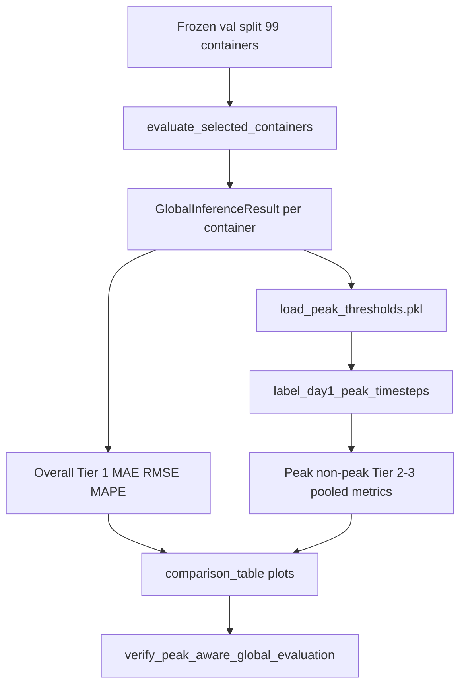

# Stage 3 — Evaluation + Verification (Task Plan)

[← Implementation Record](02-implementation-record.md) · [Study Overview](README.md) · [Design lock JSON](../experiments/peak_aware_global_design_2026-07-17/design_lock.json) · [Stage 2 lock JSON](../experiments/peak_aware_global_2026-07-17_164737/phase2_implementation.json)

---

## 1. Stage 3 — Evaluation

### 1.1 Objective

Execute a **fair paired comparison** between the frozen Global GRU baseline (`global_gru_v1`) and the Peak-Aware Global GRU treatment model. Report overall Day 1 metrics plus peak-subset metrics using the locked P90 definition — without modifying frozen baseline code, retraining models, or tuning hyperparameters.

**Control:** `experiments/global_gru_reference_2026-07-17/`  
**Treatment:** `experiments/peak_aware_global_2026-07-17_164737/`  
**Design authority:** `experiments/peak_aware_global_design_2026-07-17/design_lock.json`  
**Stage 2 gate:** `verification/fairness_check.json` — **10/10 PASS** (required before Task 1)

### 1.2 Locked Evaluation Inputs

| Item | Value |
|------|-------|
| Evaluation period | Temporal validation split — `data/val_df.parquet` |
| Train context | `data/train_df.parquet` (per-container Global GRU input window) |
| Cohort | 100 selected containers → **99 evaluable** (`c_14674` skipped) |
| Primary horizon | Day 1 — **96 steps** |
| Overall metrics | MAE, RMSE, MAPE (per container → aggregate mean/std) |
| Peak definition | P90 per-container, train-fitted thresholds — `peak/peak_thresholds.pkl` |
| Peak-subset metrics | Peak-only MAE, RMSE; non-peak MAE, RMSE |
| Inference / eval modules | **Frozen** `utils/global_inference.py`, `utils/global_evaluation.py` |
| Prediction column (Global) | `day1_pred_real` (direct CPU % forecast) |
| Peak labels | On **actual** Day-1 real CPU % — same rule as Hybrid Phase 5 |

### 1.3 Baseline Reference (Control Metrics)

Frozen Day 1 aggregate metrics from Global Phase 5 (`experiments/global_gru_reference_2026-07-17/evaluation/evaluation_summary.csv`):

| Metric | Mean |
|--------|------|
| MAE | **2.063** |
| RMSE | **2.756** |
| MAPE | **118.93** |

Per-container record: `experiments/global_gru_reference_2026-07-17/evaluation/evaluation_df.csv`

**Note:** Task 3 still **re-runs** control inference for paired peak-subset comparison (frozen `evaluation_df.csv` lacks timestep arrays). The re-run must match frozen reference per-container MAE within tolerance.

### 1.4 Stage 3 Constraints

| Constraint | Rule |
|------------|------|
| Frozen baseline code | Do **not** modify `utils/global_*.py`, `sequence_utils.py`, notebooks, or `models/` |
| No retraining | Load pre-trained weights only |
| No λ / P90 tuning | Use locked Stage 1 / Stage 2 artifacts as-is |
| Shared protocol | Both models evaluated through identical `evaluate_selected_containers()` |
| Peak labels | Reporting only — use saved `peak_thresholds.pkl`; do not change model |
| Outputs | Save under `experiments/peak_aware_global_2026-07-17_164737/evaluation/` only |
| Stage 4 scope | Architecture sensitivity synthesis and thesis narrative deferred |
| Hybrid comparison | Do **not** re-run Hybrid vs Global methodology comparison (already locked) |

### 1.5 Metric Tiers (Locked from Stage 1 / Hybrid authority)

| Tier | Metrics | Unit | Label rule |
|------|---------|------|------------|
| **Tier 1 — Overall** | MAE, RMSE, MAPE | Per container → cohort mean/std | All 96 Day-1 validation timesteps |
| **Tier 2 — Peak subset** | MAE, RMSE | Pooled across peak timesteps | `actual_cpu_real >= P90(container_train)` |
| **Tier 3 — Non-peak subset** | MAE, RMSE | Pooled across non-peak timesteps | Complement of Tier 2 |
| **Tier 4 — Optional** | MAE, RMSE by workload type | `stable` / `medium` / `spiky` | Same P90 rule; interpret `spiky` cautiously (Hybrid Phase 2) |

**Primary research question (Tier 1):** Under P90 + λ = 5, does peak-aware training change overall Day-1 accuracy vs frozen Global GRU?

**Contribution question (Tier 2):** Does peak-aware training improve accuracy specifically on peak timesteps?

**Delta convention:** `treatment − control` (Peak-Aware Global minus Global GRU).

### 1.6 Task Plan

| Task | Focus | Status |
|------|-------|--------|
| 1 | Prepare evaluation workspace + extend `peak_evaluation.py` for Global | Pending |
| 2 | Run treatment primary evaluation (peak-aware Global) | Pending |
| 3 | Compute peak-subset metrics (both models) | Pending |
| 4 | Build comparison tables + plots | Pending |
| 5 | Verification + sanity checks | Pending |
| 6 | Lock Stage 3 evaluation record | Pending |

**Execution cadence:** One task at a time with approval between tasks — same as Stage 2 and Hybrid Phase 5.

---

### Task 1 — Prepare Evaluation Workspace + Global Peak Evaluation Support

**Objective:** Add Global-compatible peak-subset metric utilities without modifying frozen `global_evaluation.py`.

**Deliverables:**

| Output | Description |
|--------|-------------|
| `utils/peak_evaluation.py` (extend) | Global adapters using existing array-level functions |
| `evaluation/evaluation_workspace.json` | Workspace metadata under treatment experiment dir |
| `evaluation/peak_evaluation_sanity.json` | Single-container sanity check record |

**Functions to add or generalize:**

| Function | Purpose |
|----------|---------|
| `compute_peak_subset_metrics_from_global_result()` | Wrap `GlobalInferenceResult` → `day1_pred_real` |
| `compute_peak_subset_metrics_from_global_cache()` | Cache key `day1_pred_real` instead of Hybrid `day1_final_real` |
| `summarize_peak_subset_metrics_from_cache()` | Pooled cohort metrics from lightweight cache dicts |

**Design notes:**

- Reuse `label_day1_peak_timesteps()` and `compute_peak_subset_metrics_from_arrays()` — peak labelling is architecture-independent.
- Reuse frozen `compute_day1_metrics()` from shared metric helpers (already used by `global_evaluation`).
- Input: `GlobalInferenceResult` from frozen `run_global_inference` (`actual_day1_real`, `day1_pred_real`).
- Thresholds: `load_peak_thresholds()` from treatment `peak/peak_thresholds.pkl`.
- Do **not** add peak logic to `utils/global_evaluation.py`.

**Sanity check:**

- Container: `c_11461` (`DEMO_CONTAINER_ID` from `global_config`).
- Run one-container Global inference (control or treatment weights — either suffices for metric math).
- Verify peak / non-peak / overall MAE and RMSE against manual calculation.

**Exit criterion:** Peak-subset functions verified on demo container; workspace JSON written.

---

### Task 2 — Run Treatment Primary Evaluation

**Objective:** Evaluate the peak-aware Global treatment model on the frozen 99-container validation cohort using unchanged `evaluate_selected_containers()`.

**Deliverables:**

| Output | Description |
|--------|-------------|
| `scripts/run_peak_aware_global_evaluation.py` | Treatment primary evaluation runner |
| `evaluation/evaluation_df.csv` | Per-container overall metrics |
| `evaluation/evaluation_summary.csv` | Cohort aggregate mean/std |
| `evaluation/evaluation_metadata.json` | Runtime, container counts, artifact paths |
| `evaluation/treatment_inference_cache.pkl` | Day-1 arrays for Task 3 (`actual_day1_real`, `day1_pred_real`) |

**Methodology:**

1. Load treatment artifacts from `experiments/peak_aware_global_2026-07-17_164737/models/`:
   - `global_gru_peak_aware.keras`
   - `global_gru_peak_aware_metadata.json` (metadata only; not required for inference)
2. Load shared data: `train_df`, `val_df`, `scalers.pkl`, `selected_containers.npy`.
3. Filter to selected-container cohort (same as baseline).
4. Call frozen `evaluate_selected_containers()` with treatment model.
5. Save outputs and lightweight inference cache.

**Implementation decisions:**

| Decision | Rationale |
|----------|-----------|
| Frozen `evaluate_selected_containers` only | Fairness contract — identical protocol to control |
| Save inference cache in Task 2 | Avoids re-running 99 inferences in Task 3 peak-subset pass |
| No control re-run in Task 2 | Control overall metrics already frozen in `global_gru_reference` |

**Exit criterion:** 99 containers evaluated (0 failures); output format matches Global baseline reference format.

---

### Task 3 — Compute Peak-Subset Metrics (Both Models)

**Objective:** Fair peak-subset comparison requires timestep-level arrays for **both** control and treatment.

**Methodology:**

1. Create `scripts/run_peak_aware_global_peak_subset_evaluation.py`.
2. **Treatment:** Reuse `treatment_inference_cache.pkl` from Task 2.
3. **Control:** Re-run `evaluate_selected_containers()` loading baseline model from `experiments/global_gru_reference_2026-07-17/models/global_gru.keras` — read-only, no baseline code changes.
4. Apply Global peak-evaluation helpers to both inference result sets with the **same** `peak/peak_thresholds.pkl`.
5. Build per-container, long-format, comparison, and pooled summaries.

**Deliverables:**

| Output | Description |
|--------|-------------|
| `evaluation/baseline_evaluation_df.csv` | Control re-run overall metrics |
| `evaluation/baseline_inference_cache.pkl` | Control Day-1 arrays (optional but recommended) |
| `evaluation/peak_subset_metrics.csv` | Long-format per-container peak/non-peak |
| `evaluation/treatment_peak_subset_per_container.csv` | Treatment per-container peak metrics |
| `evaluation/baseline_peak_subset_per_container.csv` | Control per-container peak metrics |
| `evaluation/peak_subset_per_container_comparison.csv` | Side-by-side with deltas |
| `evaluation/peak_subset_summary.csv` | Pooled cohort peak/non-peak stats |
| `evaluation/peak_subset_metadata.json` | Container counts, peak fraction, runtime |

**Sanity assertions:**

| Check | Expected |
|-------|----------|
| Containers (each model) | **99** |
| Control re-run overall MAE | Matches frozen `global_gru_reference` (±1e-5) |
| Pooled peak timestep fraction | Within Hybrid Phase 2 feasibility range (**17–31%**) — same actuals/thresholds |

**Exit criterion:** Peak-subset metrics computed for 99/99 evaluable containers; pooled peak fraction feasible; per-container peak metrics saved for both models.

---

### Task 4 — Build Comparison Tables + Plots

**Objective:** Produce thesis-ready comparison artifacts from saved Task 2/3 outputs only — no re-inference or retraining.

**Deliverables:**

| Output | Content |
|--------|---------|
| `scripts/build_peak_aware_global_comparison.py` | Comparison builder |
| `evaluation/comparison_table.csv` | Global vs Peak-Aware Global: overall + peak/non-peak MAE/RMSE |
| `evaluation/per_container_delta.csv` | Per-container ΔMAE, ΔRMSE (treatment − control) |
| `evaluation/evaluation_summary.json` | Machine-readable comparison record |
| `evaluation/plots/actual_vs_predicted_samples.png` | Sample containers (PNG + PDF) |
| `evaluation/plots/error_distribution.png` | Error distribution overlay |
| `evaluation/plots/peak_subset_comparison.png` | Peak vs non-peak bar chart |

**Comparison rules:**

| Tier | Source |
|------|--------|
| Overall Tier 1 | Treatment `evaluation_summary.csv` vs frozen `global_gru_reference` aggregates |
| Peak Tier 2/3 | Pooled peak-subset summaries from Task 3 |
| Deltas | Report **both** absolute values and `treatment − control` |

**Plot conventions:** Follow [visualization skill](../.cursor/skills/visualization/SKILL.md) — titles, axis labels, legends, saved PNG/PDF under `evaluation/plots/`.

**Exit criterion:** Comparison table complete; plots saved as PNG under `evaluation/plots/`.

---

### Task 5 — Verification + Sanity Checks

**Objective:** Audit evaluation integrity before locking results.

**Deliverables:**

| Output | Description |
|--------|-------------|
| `scripts/verify_peak_aware_global_evaluation.py` | Post-eval integrity gate |
| `evaluation/verification_check.json` | Machine-readable check record |

**Checks:**

| # | Assertion |
|---|-----------|
| 1 | Frozen `global_evaluation.py` / `global_inference.py` unmodified |
| 2 | Treatment uses correct artifacts (`global_gru_peak_aware.keras` from treatment dir) |
| 3 | Control uses baseline reference model (`global_gru_reference/models/global_gru.keras`) |
| 4 | Same 99-container cohort as `global_gru_reference` (`c_14674` skipped) |
| 5 | Overall metrics reproducible via `compute_day1_metrics()` on inference caches |
| 6 | Peak thresholds identical to `peak_thresholds.pkl` (no recompute drift) |
| 7 | Peak-subset pooled count > 0 and within Phase 2 feasibility range (17–31%) |
| 8 | No writes to `models/` or `global_gru_reference/` |

**Exit criterion:** All 8 checks PASS.

---

### Task 6 — Lock Stage 3 Evaluation Record

**Objective:** Consolidate results and mark Stage 3 complete.

**Deliverables:**

| Output | Description |
|--------|-------------|
| `experiments/peak_aware_global_2026-07-17_164737/phase3_evaluation.json` | Machine-readable lock |
| `docs/peak-aware-global/03-evaluation-record.md` | Task-by-task execution log + final summary |
| README update | Stage 3 → Complete |
| `notebooks/peak_aware_global_container_comparison.ipynb` | Manual inspection notebook (optional but recommended) |

**Exit criterion:** Stage 3 marked complete; results ready for Stage 4 interpretation.

---

## 2. Planned Artifact Layout

```
experiments/peak_aware_global_2026-07-17_164737/evaluation/
├── evaluation_workspace.json           # Task 1
├── peak_evaluation_sanity.json           # Task 1
├── evaluation_df.csv                     # treatment overall (Task 2)
├── evaluation_summary.csv
├── evaluation_metadata.json
├── treatment_inference_cache.pkl         # Task 2
├── baseline_evaluation_df.csv            # control re-run (Task 3)
├── baseline_inference_cache.pkl          # Task 3 (optional)
├── peak_subset_metrics.csv               # per-container peak/non-peak (Task 3)
├── treatment_peak_subset_per_container.csv
├── baseline_peak_subset_per_container.csv
├── peak_subset_per_container_comparison.csv
├── peak_subset_summary.csv               # pooled peak/non-peak (Task 3)
├── peak_subset_metadata.json
├── comparison_table.csv                  # baseline vs peak-aware (Task 4)
├── per_container_delta.csv               # paired deltas (Task 4)
├── evaluation_summary.json               # lock-ready comparison (Task 4)
├── verification_check.json               # Task 5
└── plots/
    ├── actual_vs_predicted_samples.png
    ├── actual_vs_predicted_samples.pdf
    ├── error_distribution.png
    ├── error_distribution.pdf
    └── peak_subset_comparison.png
```

---

## 3. New Files (Planned)

| File | Role |
|------|------|
| `utils/peak_evaluation.py` | Extend with Global cache/result adapters (parallel to frozen eval) |
| `scripts/run_peak_aware_global_evaluation.py` | Task 2 — treatment primary eval |
| `scripts/run_peak_aware_global_peak_subset_evaluation.py` | Task 3 — control re-run + peak metrics |
| `scripts/build_peak_aware_global_comparison.py` | Task 4 — tables + plots |
| `scripts/verify_peak_aware_global_evaluation.py` | Task 5 — verification gate |
| `notebooks/peak_aware_global_container_comparison.ipynb` | Task 6 — manual inspection |

**Frozen (read-only):** `utils/global_evaluation.py`, `utils/global_inference.py`, `utils/peak_detection.py` (load thresholds only)

**Reuse (read-only):** `utils/peak_evaluation.py` core array functions, `utils/hybrid_evaluation.compute_day1_metrics` (shared metrics)

---

## 4. Evaluation Workflow

```
Frozen val split + 99-container cohort
        ↓
evaluate_selected_containers()          ← frozen global_evaluation
        ↓
GlobalInferenceResult per container
  (actual_day1_real, day1_pred_real)
        ↓
Overall Tier 1 metrics                  ← compute_day1_metrics
        ↓
load_peak_thresholds.pkl
        ↓
label_day1_peak_timesteps()             ← peak_evaluation (actual CPU %)
        ↓
Peak / non-peak Tier 2–3 metrics        ← pooled MAE/RMSE
        ↓
comparison_table + plots                ← build_peak_aware_global_comparison
        ↓
verify_peak_aware_global_evaluation     ← 8 integrity checks
```



---

## 5. Exit Criteria (Before Stage 4)

- [ ] Treatment primary evaluation complete (99 containers)
- [ ] Control evaluation re-run for paired peak-subset comparison
- [ ] Overall comparison vs `global_gru_reference` documented
- [ ] Peak-subset and non-peak-subset metrics reported
- [ ] Comparison table and metadata saved
- [ ] Verification checks PASS (8/8)
- [ ] Frozen Global baseline code unmodified
- [ ] Stage 4 discussion **not** started in this stage

---

## 6. Known Limitations (Carry Forward)

From Hybrid Phases 2–3 and Stage 1 design lock — interpret results with these in mind:

1. **Near-idle zero-threshold artefact** — ~29% of train peak labels from 5 near-idle containers at P90
2. **Train/val peak rate divergence** — validation peaks ~28% vs train ~17% under fixed thresholds
3. **Spiky workload mislabelling** — high-CV near-idle containers inflate spiky-group stats
4. **MAPE instability** — near-zero CPU values; epsilon-floor MAPE used (same as Global baseline)
5. **Paired peak-subset requires inference re-run for control** — frozen `evaluation_df.csv` lacks timestep arrays
6. **Global absolute MAE higher than Hybrid** — architecture difference; this study compares within Global track only
7. **Weighted train loss vs unweighted eval** — same train/eval objective mismatch as Hybrid Phase 5

---

## 7. Estimated Effort

| Task | Effort |
|------|--------|
| Task 1 — Global peak eval adapters | ~1 hour |
| Task 2 — Treatment eval | ~5–10 min (99 containers, no Prophet) |
| Task 3 — Peak-subset (both models) | ~30–60 min |
| Task 4 — Tables + plots | ~1 hour |
| Task 5 — Verification | ~30 min |
| Task 6 — Lock record + notebook | ~30–60 min |

**Total:** ~half day including 2× 99-container Global inference (~4 s each).

---

## 8. What Stage 3 Does NOT Include

- Retraining or fine-tuning either model
- λ sensitivity analysis
- Hybrid vs Global methodology comparison (already locked at `hybrid_vs_global_2026-07-17_095147`)
- Architecture sensitivity synthesis (Stage 4 §4.7 only)
- Modifying frozen baseline code or `models/`
- Changing peak definition or thresholds using validation data
- Inference or evaluation pipeline changes
- Re-running Stage 2 fairness checks (already PASS — reference only)

---

## 9. Prerequisites (Complete)

| Prerequisite | Status |
|--------------|--------|
| Stage 1 design lock | Complete |
| Stage 2 implementation + training | Complete |
| Stage 2 fairness verification | **10/10 PASS** |
| Treatment model saved | `models/global_gru_peak_aware.keras` |
| Peak thresholds saved | `peak/peak_thresholds.pkl` |
| Control reference frozen | `experiments/global_gru_reference_2026-07-17/` |

---

**Next step:** Task 1 — extend `peak_evaluation.py` for Global + evaluation workspace sanity (await explicit go-ahead).

*Plan approved pending — implementation not started*
