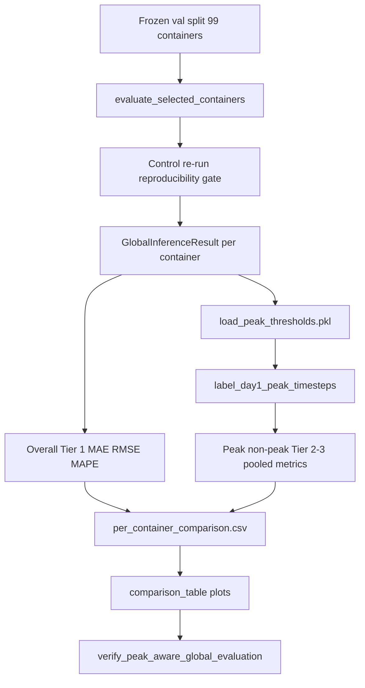

# Stage 3 — Evaluation + Verification (Task Plan)

[← Implementation Record](02-implementation-record.md) · [Study Overview](README.md) · [Design lock JSON](../experiments/peak_aware_global_design_2026-07-17/design_lock.json) · [Stage 2 lock JSON](../experiments/peak_aware_global_2026-07-17_164737/phase2_implementation.json) · [Official promotion](../experiments/peak_aware_global_validation_vs1_2026-07-17_170939/official_treatment_promotion.json)

---

## 1. Stage 3 — Evaluation

### 1.1 Objective

Execute a **fair paired comparison** between the frozen Global GRU baseline (`global_gru_v1`) and the Peak-Aware Global GRU treatment model. Report overall Day 1 metrics plus peak-subset metrics using the locked P90 definition — without modifying frozen baseline code, retraining models, or tuning hyperparameters.

**Control:** `experiments/global_gru_baseline_2026-07-17_121748/` (official; supersedes `global_gru_reference_2026-07-17/`)  
**Treatment (official):** `experiments/peak_aware_global_validation_vs1_2026-07-17_170939/`  
**Archived treatment:** `experiments/peak_aware_global_2026-07-17_164737/` — *Historical – optimization-limited (patience=3)*  
**Design authority:** `experiments/peak_aware_global_design_2026-07-17/design_lock.json`  
**Stage 2 gate:** Fairness **10/10 PASS** on official treatment (required before Task 1)

### 1.2 Locked Evaluation Inputs

| Item | Value |
|------|-------|
| Evaluation period | Temporal validation split — `data/val_df.parquet` |
| Train context | `data/train_df.parquet` (per-container Global GRU input window) |
| Cohort | 100 selected containers → **99 evaluable** (`c_14674` skipped) |
| Primary horizon | Day 1 — **96 steps** |
| Overall metrics | MAE, RMSE, MAPE (per container → aggregate mean/std) |
| Peak definition | P90 per-container, train-fitted thresholds — `peak/peak_thresholds.pkl` |
| Peak-subset metrics | Peak-only MAE, RMSE; non-peak MAE, RMSE |
| Inference / eval modules | **Frozen** `utils/global_inference.py`, `utils/global_evaluation.py` |
| Prediction column (Global) | `day1_pred_real` (direct CPU % forecast) |
| Peak labels | On **actual** Day-1 real CPU % — same rule as Hybrid Phase 5 |

### 1.3 Baseline Reference (Control Metrics)

**Official control (Phase B, 2026-07-17):** `experiments/global_gru_baseline_2026-07-17_121748/evaluation/evaluation_summary.csv`

| Metric | Mean |
|--------|------|
| MAE | **1.924** |
| RMSE | **2.611** |
| MAPE | **116.50** |

**Superseded control (historical, patience=3):** `experiments/global_gru_reference_2026-07-17/` — MAE 2.063, RMSE 2.756, MAPE 118.93

Per-container record: `experiments/global_gru_baseline_2026-07-17_121748/evaluation/evaluation_df.csv`

**Note:** Task 3 **re-runs** control inference for paired peak-subset comparison. Before any treatment comparison, the re-run must pass the **control reproducibility gate** (§1.4) against the **official** baseline evaluation.

### 1.4 Evaluation Fairness Contract

Both control and treatment evaluations **must** use the identical protocol below. The **only allowed difference** is the model weights being evaluated.

| Component | Requirement |
|-----------|-------------|
| Evaluation function | Same frozen `evaluate_selected_containers()` |
| Container cohort | Same `data/selected_containers.npy` → **99 evaluable** (`c_14674` skipped) |
| Evaluation horizon | Same Day-1 window — **96 validation timesteps** per container |
| Peak thresholds | Same train-fitted P90 thresholds — treatment `peak/peak_thresholds.pkl` |
| Evaluation protocol | Same data paths, scalers, input window, inference path, and metric helpers |

**Explicitly unchanged between control and treatment:**

- `data/train_df.parquet`, `data/val_df.parquet`, `data/scalers.pkl`
- Per-container temporal holdout inference via `run_global_inference()`
- Overall metrics via `compute_day1_metrics()` / `compute_day1_mape()`
- Peak labelling on **actual** Day-1 real CPU % (reporting only)

**Only allowed difference:** model artifact loaded (`global_gru.keras` vs `global_gru_peak_aware.keras`).

**Control reproducibility gate (mandatory before treatment comparison):**

Before comparing control vs treatment, re-run the frozen Global baseline through the same pipeline and verify that per-container and aggregate metrics reproduce the frozen `global_gru_reference` values within tolerance (`METRIC_TOLERANCE = 1e-5`). Treatment peak-subset and comparison work **must not** proceed until this gate passes.

### 1.5 Stage 3 Constraints

| Constraint | Rule |
|------------|------|
| Frozen baseline code | Do **not** modify `utils/global_*.py`, `sequence_utils.py`, notebooks, or `models/` |
| No retraining | Load pre-trained weights only |
| No λ / P90 tuning | Use locked Stage 1 / Stage 2 artifacts as-is |
| Shared protocol | Both models evaluated through identical `evaluate_selected_containers()` — see §1.4 |
| Peak labels | Reporting only — use saved `peak_thresholds.pkl`; do not change model |
| Outputs | Save under `experiments/peak_aware_global_validation_vs1_2026-07-17_170939/evaluation/` only |
| Stage 4 scope | Architecture sensitivity synthesis and thesis narrative deferred |
| Hybrid comparison | Do **not** re-run Hybrid vs Global methodology comparison (already locked) |

### 1.6 Metric Tiers (Locked from Stage 1 / Hybrid authority)

| Tier | Metrics | Unit | Label rule |
|------|---------|------|------------|
| **Tier 1 — Overall** | MAE, RMSE, MAPE | Per container → cohort mean/std | All 96 Day-1 validation timesteps |
| **Tier 2 — Peak subset** | MAE, RMSE | Pooled across peak timesteps | `actual_cpu_real >= P90(container_train)` |
| **Tier 3 — Non-peak subset** | MAE, RMSE | Pooled across non-peak timesteps | Complement of Tier 2 |
| **Tier 4 — Optional** | MAE, RMSE by workload type | `stable` / `medium` / `spiky` | Same P90 rule; interpret `spiky` cautiously (Hybrid Phase 2) |

**Primary research question (Tier 1):** Under P90 + λ = 5, does peak-aware training change overall Day-1 accuracy vs frozen Global GRU?

**Contribution question (Tier 2):** Does peak-aware training improve accuracy specifically on peak timesteps?

**Delta convention:** `treatment − control` (Peak-Aware Global minus Global GRU).

### 1.7 Task Plan

| Task | Focus | Status |
|------|-------|--------|
| 1 | Prepare evaluation workspace + extend `peak_evaluation.py` for Global | **Complete** |
| 2 | Run treatment primary evaluation (peak-aware Global) | **Complete** (official treatment, post-promotion) |
| 3 | Compute peak-subset metrics (both models) | **Complete** |
| 4 | Build comparison tables + plots | **Complete** |
| 5 | Verification + sanity checks | **Complete** |
| 6 | Lock Stage 3 evaluation record | **Complete** |

**Execution cadence:** One task at a time with approval between tasks — same as Stage 2 and Hybrid Phase 5.

---

### Task 1 — Prepare Evaluation Workspace + Global Peak Evaluation Support

**Status:** Complete  
**Date:** 2026-07-17  
**Script:** `scripts/run_peak_aware_global_peak_evaluation_sanity.py`

#### Sanity check results (`c_11461`)

| Check | Result |
|-------|--------|
| Peak MAE vs manual | **Match** |
| Peak RMSE vs manual | **Match** |
| Non-peak MAE vs manual | **Match** |
| Non-peak RMSE vs manual | **Match** |
| Overall MAE / RMSE vs manual | **Match** |
| Peak step count | **14 / 96** (14.6% peak fraction) |
| Pooled summary (single container) | **Match** |
| Pipeline status | **PASS** |

**Records:**
- `experiments/peak_aware_global_validation_vs1_2026-07-17_170939/evaluation/peak_evaluation_sanity.json`
- `experiments/peak_aware_global_validation_vs1_2026-07-17_170939/evaluation/evaluation_workspace.json`

#### Next Task

**Task 2 — Run treatment primary evaluation:** `scripts/run_peak_aware_global_evaluation.py`

---

### Task 2 — Run Treatment Primary Evaluation

**Status:** Complete  
**Date:** 2026-07-17  
**Script:** `scripts/run_peak_aware_global_evaluation.py`

#### Treatment evaluation results

| Item | Value |
|------|-------|
| Evaluated containers | **99** |
| Skipped | **1** (`c_14674` — same as control) |
| Failures | **0** |
| Runtime | **~3.8 s** |
| Mean Day-1 MAE | **2.174** |
| Mean Day-1 RMSE | **2.758** |
| Mean Day-1 MAPE | **163.77** |

**Official Global control reference:** MAE **1.924**, RMSE **2.611**, MAPE **116.50** (`experiments/global_gru_baseline_2026-07-17_121748/`)

Formal comparison and peak-subset analysis are Tasks 3–4.

#### Saved artifacts

| Output | Location |
|--------|----------|
| Per-container metrics | `evaluation/evaluation_df.csv` |
| Aggregate summary | `evaluation/evaluation_summary.csv` |
| Evaluation metadata | `evaluation/evaluation_metadata.json` |
| Inference cache (Task 3) | `evaluation/treatment_inference_cache.pkl` |

#### Next Task

**Task 3 — Compute peak-subset metrics (both models):** control re-run + reproducibility gate + peak metrics.

---

### Task 3 — Compute Peak-Subset Metrics (Both Models)

**Status:** Complete  
**Date:** 2026-07-17  
**Script:** `scripts/run_peak_aware_global_peak_subset_evaluation.py`

> **Phase B baseline correction (2026-07-17):** Comparison artifacts were regenerated against the approved official Global baseline (`patience=10`, MAE 1.924). Values originally logged against the superseded reference (`global_gru_reference_2026-07-17`, MAE 2.063, peak Δ −0.884 / overall Δ +0.111) are preserved only in §10 and historical experiment records.

#### Control reproducibility gate

| Check | Result |
|-------|--------|
| Per-container MAE/RMSE/MAPE | **PASS** (max abs delta ≈ 1e-13) |
| Aggregate mean/std/min/max | **PASS** (max abs delta ≈ 4e-7) |
| Gate status | **PASS** |
| Baseline re-run runtime | **~3.8 s** |

**Record:** `evaluation/baseline_reproducibility_check.json`

#### Peak-subset results (pooled, 99 containers)

| Model | Peak fraction | Peak MAE | Peak RMSE | Non-peak MAE | Non-peak RMSE |
|-------|---------------|----------|-----------|--------------|---------------|
| Baseline (Global GRU) | **25.65%** | **3.426** | **6.559** | **1.406** | **2.455** |
| Treatment (Peak-Aware) | **25.65%** | **2.649** | **5.316** | **2.010** | **3.502** |
| Δ (treatment − control) | — | **−0.777** | **−1.243** | **+0.604** | **+1.047** |

Peak fraction **25.65%** is within the Hybrid Phase 2 feasibility range (17–31%).

#### Sanity assertions

| Check | Expected | Result |
|-------|----------|--------|
| Control reproducibility gate | PASS (±1e-5) | **PASS** |
| Containers (each model) | 99 | **99** |
| Pooled peak timestep fraction | 17–31% | **25.65%** ✓ |

#### Saved artifacts

| Output | Location |
|--------|----------|
| Control re-run metrics | `evaluation/baseline_evaluation_df.csv` |
| Reproducibility gate | `evaluation/baseline_reproducibility_check.json` |
| Control inference cache | `evaluation/baseline_inference_cache.pkl` |
| Long-format peak metrics | `evaluation/peak_subset_metrics.csv` |
| Per-container peak (treatment) | `evaluation/treatment_peak_subset_per_container.csv` |
| Per-container peak (baseline) | `evaluation/baseline_peak_subset_per_container.csv` |
| Peak-only comparison | `evaluation/peak_subset_per_container_comparison.csv` |
| Pooled peak summary | `evaluation/peak_subset_summary.csv` |
| Task metadata | `evaluation/peak_subset_metadata.json` |

#### Next Task

**Task 4 — Build comparison tables + plots:** `scripts/build_peak_aware_global_comparison.py`

---

### Task 4 — Build Comparison Tables + Plots

**Status:** Complete  
**Date:** 2026-07-17  
**Script:** `scripts/build_peak_aware_global_comparison.py`

#### Cohort-level comparison (`comparison_table.csv`)

| Scope | Metric | Baseline | Treatment | Δ (treatment − control) |
|-------|--------|----------|-----------|------------------------|
| Overall | MAE | **1.924** | **2.174** | **+0.249** |
| Overall | RMSE | **2.611** | **2.758** | **+0.147** |
| Overall | MAPE | **116.50** | **163.77** | **+47.27** |
| Peak subset | Peak MAE | **3.426** | **2.649** | **−0.777** |
| Peak subset | Peak RMSE | **6.559** | **5.316** | **−1.243** |
| Peak subset | Non-peak MAE | **1.406** | **2.010** | **+0.604** |
| Peak subset | Non-peak RMSE | **2.455** | **3.502** | **+1.047** |

Overall metrics use the official Global baseline (`global_gru_baseline_2026-07-17_121748`); peak-subset from Task 3 pooled summaries.

#### Per-container summary

| Item | Value |
|------|-------|
| Rows in `per_container_comparison.csv` | **99** |
| Mean ΔMAE (treatment − control) | **+0.249** |
| Containers improved (ΔMAE < 0) | **23** |
| Containers worsened (ΔMAE > 0) | **76** |
| Containers with peak MAE improved | **89 / 98** |
| Sample plot containers | median / best / worst ΔMAE |

#### Saved artifacts

| Output | Location |
|--------|----------|
| Cohort comparison table | `evaluation/comparison_table.csv` |
| Primary Stage 4 artifact | `evaluation/per_container_comparison.csv` |
| Machine-readable summary | `evaluation/evaluation_summary.json` |
| Actual vs predicted samples | `evaluation/plots/actual_vs_predicted_samples.png` (+ PDF) |
| Error distribution | `evaluation/plots/error_distribution.png` (+ PDF) |
| Peak-subset bar chart | `evaluation/plots/peak_subset_comparison.png` (+ PDF) |

#### Next Task

**Task 5 — Verification + sanity checks:** `scripts/verify_peak_aware_global_evaluation.py`

---

### Task 5 — Verification + Sanity Checks

**Status:** Complete  
**Date:** 2026-07-17  
**Script:** `scripts/verify_peak_aware_global_evaluation.py`

#### Verification results (10/10 PASS)

| # | Check | Result |
|---|-------|--------|
| 1 | Official treatment path (VS-1 promoted; archived not active source) | **PASS** |
| 2 | Control reproducibility (`baseline_reproducibility_check.json`) | **PASS** |
| 3 | Cohort consistency (99 eval, `c_14674` skipped, 0 failures) | **PASS** |
| 4 | Metric consistency (`evaluation_summary.csv` / `comparison_table.csv` / `evaluation_summary.json`) | **PASS** |
| 5 | Peak-threshold consistency (99 train-fitted P90; no val-derived) | **PASS** |
| 6 | Peak-subset consistency (25.65% fraction; cache reproduction) | **PASS** |
| 7 | `per_container_comparison.csv` integrity (99 rows, schema, deltas) | **PASS** |
| 8 | Plot integrity (6 PNG/PDF files present) | **PASS** |
| 9 | Frozen evaluation path (`global_evaluation` / `global_inference` unmodified) | **PASS** |
| 10 | Final methodology audit (λ=5 + ES patience=10 only diffs) | **PASS** |

**Overall status:** **PASS**  
**Record:** `verification/evaluation_verification.json`

#### Warnings (non-blocking)

1. Training metadata retains archived patience=3 run as VS-1 lineage reference; evaluation artifacts use the promoted VS-1 experiment only.
2. Treatment improves pooled peak MAE (−0.777) but worsens overall MAE (+0.249) due to non-peak degradation — interpret Tier 1 and Tier 2 jointly in Stage 4.

#### Lock recommendation

**READY** — Stage 3 evaluation is internally consistent; proceed to Task 6 lock record when approved.

#### Next Task

**Task 6 — Lock Stage 3 evaluation record** — **Complete** (see [03-evaluation-record.md](03-evaluation-record.md))

---

### Task 6 — Lock Stage 3 Evaluation Record

**Status:** Complete  
**Date:** 2026-07-17

#### Deliverables

| Output | Location |
|--------|----------|
| Stage 3 lock JSON | `phase3_evaluation.json` |
| Evaluation record doc | `docs/peak-aware-global/03-evaluation-record.md` |
| README update | Stage 3 → **Complete** |
| Implementation workspace update | `experiments/peak_aware_global_implementation_2026-07-17/experiment_metadata.json` |

#### Stage 3 handoff summary

| Evaluation Tier | Result |
|-----------------|--------|
| **Overall** | Treatment MAE **+0.249** vs official Global GRU; Tier 1 not improved |
| **Peak subset** | Treatment peak MAE **−0.777**; Tier 2 contribution achieved |
| **Non-peak subset** | Treatment non-peak MAE **+0.604**; non-peak degradation |
| **Containers improved (overall)** | **23 / 99** |
| **Containers improved (peak)** | **89 / 98** |
| **Evaluation verification** | **10 / 10 PASS** |

**Stage 3 status:** **Complete and locked** — ready for Stage 4 Discussion.

---

### Task 2 — Run Treatment Primary Evaluation *(plan reference)*

**Objective:** Add Global-compatible peak-subset metric utilities without modifying frozen `global_evaluation.py`.

**Deliverables:**

| Output | Description |
|--------|-------------|
| `utils/peak_evaluation.py` (extend) | Global adapters using existing array-level functions |
| `evaluation/evaluation_workspace.json` | Workspace metadata under treatment experiment dir |
| `evaluation/peak_evaluation_sanity.json` | Single-container sanity check record |

**Functions to add or generalize:**

| Function | Purpose |
|----------|---------|
| `compute_peak_subset_metrics_from_global_result()` | Wrap `GlobalInferenceResult` → `day1_pred_real` |
| `compute_peak_subset_metrics_from_global_cache()` | Cache key `day1_pred_real` instead of Hybrid `day1_final_real` |
| `summarize_peak_subset_metrics_from_cache()` | Pooled cohort metrics from lightweight cache dicts |

**Design notes:**

- Reuse `label_day1_peak_timesteps()` and `compute_peak_subset_metrics_from_arrays()` — peak labelling is architecture-independent.
- Reuse frozen `compute_day1_metrics()` from shared metric helpers (already used by `global_evaluation`).
- Input: `GlobalInferenceResult` from frozen `run_global_inference` (`actual_day1_real`, `day1_pred_real`).
- Thresholds: `load_peak_thresholds()` from treatment `peak/peak_thresholds.pkl`.
- Do **not** add peak logic to `utils/global_evaluation.py`.

**Sanity check:**

- Container: `c_11461` (`DEMO_CONTAINER_ID` from `global_config`).
- Run one-container Global inference (control or treatment weights — either suffices for metric math).
- Verify peak / non-peak / overall MAE and RMSE against manual calculation.

**Exit criterion:** Peak-subset functions verified on demo container; workspace JSON written.

---

### Task 2 — Run Treatment Primary Evaluation

**Objective:** Evaluate the peak-aware Global treatment model on the frozen 99-container validation cohort using unchanged `evaluate_selected_containers()`.

**Deliverables:**

| Output | Description |
|--------|-------------|
| `scripts/run_peak_aware_global_evaluation.py` | Treatment primary evaluation runner |
| `evaluation/evaluation_df.csv` | Per-container overall metrics |
| `evaluation/evaluation_summary.csv` | Cohort aggregate mean/std |
| `evaluation/evaluation_metadata.json` | Runtime, container counts, artifact paths |
| `evaluation/treatment_inference_cache.pkl` | Day-1 arrays for Task 3 (`actual_day1_real`, `day1_pred_real`) |

**Methodology:**

1. Load treatment artifacts from `experiments/peak_aware_global_validation_vs1_2026-07-17_170939/models/`:
   - `global_gru_peak_aware.keras`
   - `global_gru_peak_aware_metadata.json` (metadata only; not required for inference)
2. Load shared data: `train_df`, `val_df`, `scalers.pkl`, `selected_containers.npy`.
3. Filter to selected-container cohort (same as baseline).
4. Call frozen `evaluate_selected_containers()` with treatment model — per §1.4 fairness contract.
5. Save outputs and lightweight inference cache.

**Implementation decisions:**

| Decision | Rationale |
|----------|-----------|
| Frozen `evaluate_selected_containers` only | Fairness contract — identical protocol to control |
| Save inference cache in Task 2 | Avoids re-running 99 inferences in Task 3 peak-subset pass |
| No control re-run in Task 2 | Control overall metrics already frozen in `global_gru_reference` |

**Exit criterion:** 99 containers evaluated (0 failures); output format matches Global baseline reference format.

---

### Task 3 — Compute Peak-Subset Metrics (Both Models)

**Objective:** Fair peak-subset comparison requires timestep-level arrays for **both** control and treatment.

**Methodology:**

1. Create `scripts/run_peak_aware_global_peak_subset_evaluation.py`.
2. **Control first:** Re-run `evaluate_selected_containers()` loading baseline model from `experiments/global_gru_baseline_2026-07-17_121748/models/global_gru.keras` — read-only, no baseline code changes.
3. **Control reproducibility gate:** Compare re-run `baseline_evaluation_df.csv` against frozen official baseline `evaluation/evaluation_df.csv` and aggregate summary — per-container MAE/RMSE/MAPE and cohort means must match within `METRIC_TOLERANCE = 1e-5`. **Stop if gate fails.**
4. **Treatment:** Reuse `treatment_inference_cache.pkl` from Task 2 (re-run only if cache missing).
5. Apply Global peak-evaluation helpers to both inference result sets with the **same** `peak/peak_thresholds.pkl`.
6. Build per-container, long-format, pooled summaries, and the standardized per-container comparison table (Task 4 schema).

**Deliverables:**

| Output | Description |
|--------|-------------|
| `evaluation/baseline_evaluation_df.csv` | Control re-run overall metrics |
| `evaluation/baseline_reproducibility_check.json` | Control re-run vs frozen reference gate record |
| `evaluation/baseline_inference_cache.pkl` | Control Day-1 arrays (recommended) |
| `evaluation/peak_subset_metrics.csv` | Long-format per-container peak/non-peak |
| `evaluation/treatment_peak_subset_per_container.csv` | Treatment per-container peak metrics |
| `evaluation/baseline_peak_subset_per_container.csv` | Control per-container peak metrics |
| `evaluation/peak_subset_per_container_comparison.csv` | Peak-only side-by-side with deltas (intermediate) |
| `evaluation/peak_subset_summary.csv` | Pooled cohort peak/non-peak stats |
| `evaluation/peak_subset_metadata.json` | Container counts, peak fraction, runtime |

**Sanity assertions:**

| Check | Expected |
|-------|----------|
| Control reproducibility gate | **PASS** — re-run matches frozen reference (±1e-5) |
| Containers (each model) | **99** |
| Pooled peak timestep fraction | Within Hybrid Phase 2 feasibility range (**17–31%**) — same actuals/thresholds |

**Exit criterion:** Control reproducibility gate PASS; peak-subset metrics computed for 99/99 evaluable containers; pooled peak fraction feasible; per-container peak metrics saved for both models.

---

### Task 4 — Build Comparison Tables + Plots

**Objective:** Produce thesis-ready comparison artifacts from saved Task 2/3 outputs only — no re-inference or retraining.

**Deliverables:**

| Output | Content |
|--------|---------|
| `scripts/build_peak_aware_global_comparison.py` | Comparison builder |
| `evaluation/comparison_table.csv` | Cohort-level: overall + peak/non-peak MAE/RMSE |
| `evaluation/per_container_comparison.csv` | **Primary Stage 4 artifact** — full per-container paired table (see schema below) |
| `evaluation/evaluation_summary.json` | Machine-readable comparison record |
| `evaluation/plots/actual_vs_predicted_samples.png` | Sample containers (PNG + PDF) |
| `evaluation/plots/error_distribution.png` | Error distribution overlay |
| `evaluation/plots/peak_subset_comparison.png` | Peak vs non-peak bar chart |

**Required schema — `per_container_comparison.csv`:**

One row per evaluable container (`container_id`). All deltas use `treatment − control` (Peak-Aware Global minus Global GRU).

| Column group | Columns |
|--------------|---------|
| **Overall (Tier 1)** | `baseline_day1_mae`, `baseline_day1_rmse`, `baseline_day1_mape`, `treatment_day1_mae`, `treatment_day1_rmse`, `treatment_day1_mape`, `delta_day1_mae`, `delta_day1_rmse`, `delta_day1_mape` |
| **Peak (Tier 2)** | `baseline_peak_mae`, `baseline_peak_rmse`, `treatment_peak_mae`, `treatment_peak_rmse`, `delta_peak_mae`, `delta_peak_rmse` |
| **Non-peak (Tier 3)** | `baseline_non_peak_mae`, `baseline_non_peak_rmse`, `treatment_non_peak_mae`, `treatment_non_peak_rmse`, `delta_non_peak_mae`, `delta_non_peak_rmse` |

This file is a **mandatory pipeline output** and the primary per-container input for Stage 4 stratified analysis and discussion.

**Comparison rules:**

| Tier | Source |
|------|--------|
| Overall Tier 1 | Treatment `evaluation_summary.csv` vs frozen `global_gru_reference` aggregates |
| Peak Tier 2/3 | Pooled peak-subset summaries from Task 3 |
| Deltas | Report **both** absolute values and `treatment − control` |

**Plot conventions:** Follow [visualization skill](../.cursor/skills/visualization/SKILL.md) — titles, axis labels, legends, saved PNG/PDF under `evaluation/plots/`.

**Exit criterion:** Comparison table complete; `per_container_comparison.csv` saved with full schema; plots saved as PNG under `evaluation/plots/`.

---

### Task 5 — Verification + Sanity Checks

**Objective:** Audit evaluation integrity before locking results.

**Deliverables:**

| Output | Description |
|--------|-------------|
| `scripts/verify_peak_aware_global_evaluation.py` | Post-eval integrity gate |
| `evaluation/verification_check.json` | Machine-readable check record |

**Checks:**

| # | Assertion |
|---|-----------|
| 1 | Frozen `global_evaluation.py` / `global_inference.py` unmodified |
| 2 | Treatment uses correct artifacts (`global_gru_peak_aware.keras` from treatment dir) |
| 3 | Control uses baseline reference model (`global_gru_reference/models/global_gru.keras`) |
| 4 | Same 99-container cohort as `global_gru_reference` (`c_14674` skipped) |
| 5 | **Control baseline reproducibility** — re-run matches frozen reference per-container and aggregate metrics (±1e-5) |
| 6 | Overall metrics reproducible via `compute_day1_metrics()` on inference caches |
| 7 | Peak thresholds identical to `peak_thresholds.pkl` (no recompute drift) |
| 8 | Peak-subset pooled count > 0 and within Phase 2 feasibility range (17–31%) |
| 9 | `per_container_comparison.csv` present with required schema (99 rows) |
| 10 | No writes to `models/` or `global_gru_reference/` |

**Exit criterion:** All 10 checks PASS.

---

### Task 6 — Lock Stage 3 Evaluation Record

**Objective:** Consolidate results and mark Stage 3 complete.

**Deliverables:**

| Output | Description |
|--------|-------------|
| `experiments/peak_aware_global_validation_vs1_2026-07-17_170939/phase3_evaluation.json` | Machine-readable lock |
| `docs/peak-aware-global/03-evaluation-record.md` | Task-by-task execution log + final summary |
| README update | Stage 3 → Complete |
| `notebooks/peak_aware_global_container_comparison.ipynb` | Manual inspection notebook (optional but recommended) |

**Exit criterion:** Stage 3 marked complete; `per_container_comparison.csv` locked as primary Stage 4 input; results ready for Stage 4 interpretation.

---

## 2. Planned Artifact Layout

```
experiments/peak_aware_global_validation_vs1_2026-07-17_170939/evaluation/
├── evaluation_workspace.json           # Task 1
├── peak_evaluation_sanity.json           # Task 1
├── evaluation_df.csv                     # treatment overall (Task 2)
├── evaluation_summary.csv
├── evaluation_metadata.json
├── treatment_inference_cache.pkl         # Task 2
├── baseline_evaluation_df.csv            # control re-run (Task 3)
├── baseline_reproducibility_check.json   # control vs frozen reference gate (Task 3)
├── baseline_inference_cache.pkl          # Task 3
├── peak_subset_metrics.csv               # per-container peak/non-peak (Task 3)
├── treatment_peak_subset_per_container.csv
├── baseline_peak_subset_per_container.csv
├── peak_subset_per_container_comparison.csv
├── peak_subset_summary.csv               # pooled peak/non-peak (Task 3)
├── peak_subset_metadata.json
├── comparison_table.csv                  # cohort-level summary (Task 4)
├── per_container_comparison.csv          # primary Stage 4 per-container artifact (Task 4)
├── evaluation_summary.json               # lock-ready comparison (Task 4)
├── verification_check.json               # Task 5
└── plots/
    ├── actual_vs_predicted_samples.png
    ├── actual_vs_predicted_samples.pdf
    ├── error_distribution.png
    ├── error_distribution.pdf
    └── peak_subset_comparison.png
```

---

## 3. New Files (Planned)

| File | Role |
|------|------|
| `utils/peak_evaluation.py` | Extend with Global cache/result adapters (parallel to frozen eval) |
| `scripts/run_peak_aware_global_evaluation.py` | Task 2 — treatment primary eval |
| `scripts/run_peak_aware_global_peak_subset_evaluation.py` | Task 3 — control re-run + peak metrics |
| `scripts/build_peak_aware_global_comparison.py` | Task 4 — tables + plots |
| `scripts/verify_peak_aware_global_evaluation.py` | Task 5 — verification gate |
| `notebooks/peak_aware_global_container_comparison.ipynb` | Task 6 — manual inspection |

**Frozen (read-only):** `utils/global_evaluation.py`, `utils/global_inference.py`, `utils/peak_detection.py` (load thresholds only)

**Reuse (read-only):** `utils/peak_evaluation.py` core array functions, `utils/hybrid_evaluation.compute_day1_metrics` (shared metrics)

---

## 4. Evaluation Workflow

```
Frozen val split + 99-container cohort
        ↓
evaluate_selected_containers()          ← frozen global_evaluation (§1.4)
        ↓
Control re-run → reproducibility gate   ← must PASS before treatment comparison
        ↓
GlobalInferenceResult per container
  (actual_day1_real, day1_pred_real)
        ↓
Overall Tier 1 metrics                  ← compute_day1_metrics
        ↓
load_peak_thresholds.pkl                ← same train-fitted P90 for both models
        ↓
label_day1_peak_timesteps()             ← peak_evaluation (actual CPU %)
        ↓
Peak / non-peak Tier 2–3 metrics        ← pooled MAE/RMSE
        ↓
per_container_comparison.csv            ← primary Stage 4 artifact
comparison_table + plots                ← build_peak_aware_global_comparison
        ↓
verify_peak_aware_global_evaluation     ← 10 integrity checks
```



---

## 5. Exit Criteria (Before Stage 4)

- [x] Treatment primary evaluation complete (99 containers)
- [x] Control evaluation re-run passes reproducibility gate vs `global_gru_reference`
- [x] Overall comparison vs `global_gru_reference` documented
- [x] Peak-subset and non-peak-subset metrics reported
- [x] `per_container_comparison.csv` saved with full schema (primary Stage 4 input)
- [x] Cohort-level comparison table and metadata saved
- [x] Verification checks PASS (10/10)
- [ ] Frozen Global baseline code unmodified
- [x] Stage 4 discussion **not** started in this stage

---

## 6. Known Limitations (Carry Forward)

From Hybrid Phases 2–3 and Stage 1 design lock — interpret results with these in mind:

1. **Near-idle zero-threshold artefact** — ~29% of train peak labels from 5 near-idle containers at P90
2. **Train/val peak rate divergence** — validation peaks ~28% vs train ~17% under fixed thresholds
3. **Spiky workload mislabelling** — high-CV near-idle containers inflate spiky-group stats
4. **MAPE instability** — near-zero CPU values; epsilon-floor MAPE used (same as Global baseline)
5. **Paired peak-subset requires inference re-run for control** — frozen `evaluation_df.csv` lacks timestep arrays
6. **Global absolute MAE higher than Hybrid** — architecture difference; this study compares within Global track only
7. **Weighted train loss vs unweighted eval** — same train/eval objective mismatch as Hybrid Phase 5

---

## 7. Estimated Effort

| Task | Effort |
|------|--------|
| Task 1 — Global peak eval adapters | ~1 hour |
| Task 2 — Treatment eval | ~5–10 min (99 containers, no Prophet) |
| Task 3 — Peak-subset (both models) | ~30–60 min |
| Task 4 — Tables + plots | ~1 hour |
| Task 5 — Verification | ~30 min |
| Task 6 — Lock record + notebook | ~30–60 min |

**Total:** ~half day including 2× 99-container Global inference (~4 s each).

---

## 8. What Stage 3 Does NOT Include

- Retraining or fine-tuning either model
- λ sensitivity analysis
- Hybrid vs Global methodology comparison (already locked at `hybrid_vs_global_2026-07-17_095147`)
- Architecture sensitivity synthesis (Stage 4 §4.7 only)
- Modifying frozen baseline code or `models/`
- Changing peak definition or thresholds using validation data
- Inference or evaluation pipeline changes
- Re-running Stage 2 fairness checks (already PASS — reference only)

---

## 9. Prerequisites (Complete)

| Prerequisite | Status |
|--------------|--------|
| Stage 1 design lock | Complete |
| Stage 2 implementation + training | Complete |
| Stage 2 fairness verification | **10/10 PASS** |
| Treatment model saved | `models/global_gru_peak_aware.keras` |
| Peak thresholds saved | `peak/peak_thresholds.pkl` |
| Control reference (official) | `experiments/global_gru_baseline_2026-07-17_121748/` |
| Superseded control (historical) | `experiments/global_gru_reference_2026-07-17/` |

---

**Stage 3 status:** **Complete and locked** — see [03-evaluation-record.md](03-evaluation-record.md). Stage 4 Discussion complete.

---

## 10. Phase B Addendum — Regenerated vs Corrected Global Baseline (2026-07-17)

After Global baseline correction (`patience=10`), all Stage 3 comparison artifacts were **regenerated** against `experiments/global_gru_baseline_2026-07-17_121748/` without retraining the Peak-Aware treatment model.

### Updated control metrics (official)

| Metric | Baseline | Treatment | Δ (treatment − baseline) |
|--------|----------|-----------|-------------------------|
| Overall MAE | **1.924** | **2.174** | **+0.249** |
| Overall RMSE | **2.611** | **2.758** | **+0.147** |
| Peak MAE | **3.426** | **2.649** | **−0.777** |
| Peak RMSE | **6.559** | **5.316** | **−1.243** |
| Non-peak MAE | **1.406** | **2.010** | **+0.604** |
| Non-peak RMSE | **2.455** | **3.502** | **+1.047** |

### Updated per-container outcomes

| Outcome | Count |
|---------|-------|
| Improved overall (ΔMAE < 0) | **23 / 99** |
| Worsened overall | **76 / 99** |
| Improved peak MAE | **89 / 98** |

### Regenerated artifacts

- `evaluation/baseline_evaluation_df.csv`, `baseline_inference_cache.pkl`
- `evaluation/comparison_table.csv`, `per_container_comparison.csv`, `evaluation_summary.json`
- `evaluation/plots/` (6 files)
- `verification/evaluation_verification.json` — **10/10 PASS**
- `phase3_evaluation.json`, `03-evaluation-record.md`, `04-discussion-record.md`

Task 3–4 result tables above reflect the **Phase B–regenerated** official baseline. §10 documents the regeneration provenance and superseded pre-correction values for audit traceability.

*Stage 3 Task 6 complete — phase3_evaluation.json locked; Phase B regeneration complete*
