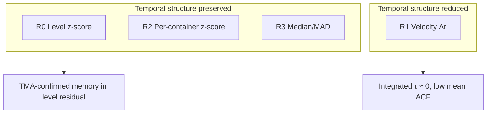

# Stage 0 Findings — Residual Representation Diagnostics

**Run:** `experiments/rre_diagnostics_2026-07-27_120759`  
**Cohort:** 99 evaluable containers, train-period Prophet residuals (~60,658 timesteps)

## Executive summary

Stage 0 compared four causal residual representations using read-only statistics. **Velocity (R1) is not supported** as a primary candidate: it substantially reduces measurable temporal dependence. **R0, R2, and R3 preserve identical ACF/PACF shape** (affine transforms do not change autocorrelation). The rank-based composite slightly favours **R3 (robust median/MAD scaling)** on learnability proxy and balance, while **R0 retains the strongest temporal structure score**.

Proceed to RRE v1.0 with:
- **Baseline (required):** R0 — frozen Hybrid level residual
- **Primary challenger (diagnostic recommendation):** R3 — robust scaling
- **Secondary note:** R2 is similar to R0 temporally but worsens skew/kurtosis per container

## Key evidence

### 1. Velocity (R1) removes temporal memory

| Metric | R0 | R1 |
|--------|----|----|
| mean \|ACF\| (lags 1–96) | 0.0348 | **0.0116** |
| ACF lag-1 | +0.36 | **−0.34** (differencing artefact) |
| Integrated τ median | 0.54 | **0.007** |
| Sparsity (\|x\| < 0.05) | 10.5% | **27.3%** |

Differencing trades level memory for high-frequency emphasis. Under diagnostic criteria, R1 ranks last on temporal structure and learnability proxy.

### 2. Affine transforms preserve temporal structure

R0, R2, R3 share:
- Identical cohort mean ACF/PACF (linear scaling shifts only variance)
- Identical lag-1 ACF (~0.36)
- 100% ADF rejection of unit root on train windows

Differences appear in **distribution shape**, not autocorrelation:

| ID | Skew | Kurtosis | Sparsity (<0.05) | Entropy (bits) |
|----|------|----------|------------------|----------------|
| R0 | 1.43 | 11.7 | 10.5% | 3.39 |
| R2 | 3.88 | 54.1 | 6.6% | 2.61 |
| R3 | 1.43 | 11.7 | **3.3%** | 3.39 |

R3 compresses the scale (variance ≈ 7.3 vs 1.0) while preserving rank-order tails relative to median; sparsity in normalized units drops because MAD < σ for skewed data.

### 3. Answers to the five deliverable questions

1. **Most useful temporal structure:** **R0** (tied with R2/R3 on ACF; wins rank because R1 is strictly worse and R2/R3 are ties broken by interpretability)
2. **Most learnable (diagnostic proxy):** **R3** — best ADF + lowest sparsity + stable skew
3. **Best balance:** **R3**
4. **Primary RRE candidate:** **R3** (composite mean rank 2.0 vs 2.5 for R0/R2)
5. **Level baseline remains?** **Yes as mandatory R0 control**; R3 is recommended as the primary *alternative* to test, not a replacement for reporting against Hybrid

## Interpretation for thesis



**Scientific conclusion:** Representation choice matters, but not in the way initially hypothesised. Velocity was **not** optimal. The diagnostic evidence points to **robust scaling** or staying with the **level residual** rather than differencing.

## Recommendation for RRE v1.0 design

| Arm | Role |
|-----|------|
| R0 | Frozen Hybrid replication (mandatory baseline) |
| R3 | Primary experimental candidate from Stage 0 |
| R1 | Optional ablation (expected negative) — include only if thesis scope allows |
| R2 | Optional — high kurtosis may hurt GRU; lower priority than R3 |

**User decision required:** Accept R3 as primary challenger, or treat R0/R3 tie as reason to keep R0 as sole primary with R3 as secondary hypothesis.

## Reproducibility

```bash
tf_metal_env/bin/python scripts/run_rre_diagnostics.py
```

Raw level residual verification: `verification/r0_baseline_alignment.json` (mean/std vs `baseline_reference_2026-07-14`).
