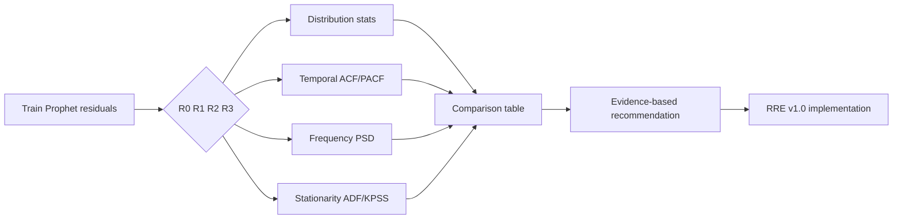

# Residual Representation Diagnostic Study (Stage 0)

**Protocol:** `rre_diagnostics_v1.0`  
**Type:** Read-only statistical analysis — no GRU training, no model implementation.

## Purpose

Before implementing **RRE v1.0** (Residual Representation Experiment), this stage objectively compares causal residual representations using statistical diagnostics only. The goal is to determine **which representation should become the primary experimental candidate** — not to assume velocity (first-order difference) is optimal.

## Why this stage was added

| Prior finding | Implication |
|---------------|-------------|
| Prophet explains ~78% of CPU variance | Residual is the GRU target domain |
| Residual is centred, skewed, heavy-tailed | Distribution shape affects learnability |
| Hybrid improves over Prophet consistently | GRU adds value, but gains may be capped |
| Loss, context, window, peak-weight changes did not help much | Limitation may be **representation**, not training |

Prior experiments (TMA, HCERL, LFHE, GGTCE, context feasibility) studied **how** the GRU learns or **what memory** exists. They did **not** compare alternative **residual encodings**. RRE Stage 0 closes that gap.

## Representations compared

| ID | Name | Transform |
|----|------|-----------|
| **R0** | Level residual (global z-score) | Frozen Hybrid baseline |
| **R1** | First-order difference | Δr, global z-score on train Δ |
| **R2** | Per-container normalization | Container train μ/σ |
| **R3** | Robust scaling | Global train median / MAD |

All statistics are fit on **train period only** (99 evaluable containers). No validation leakage.

## Diagnostics per representation

1. **Distribution** — histogram, KDE, QQ, skewness, kurtosis, variance, entropy, sparsity  
2. **Temporal** — ACF, PACF, Ljung–Box, memory length, decorrelation lag  
3. **Frequency** — PSD, dominant frequencies, daily-cycle power  
4. **Stationarity** — ADF, KPSS (per container, cohort summary)  
5. **Information** — qualitative assessment of structure preservation

## Comparison dimensions

Temporal dependence, stationarity, sparsity, skewness, heavy tails, variance, interpretability, inference complexity, reconstruction complexity, leakage risk.

## Isolation

Same philosophy as TMA and HCERL:

```
utils/rre_diagnostics/
scripts/run_rre_diagnostics.py
scripts/build_rre_diagnostics_notebook.py
notebooks/residual_representation_diagnostics.ipynb
docs/residual_representation_diagnostics/
experiments/rre_diagnostics_<timestamp>/
```

Does **not** modify baseline Hybrid, production pipeline, or prior experiments.

## How to run

```bash
tf_metal_env/bin/python scripts/run_rre_diagnostics.py
tf_metal_env/bin/python scripts/build_rre_diagnostics_notebook.py
```

Update `EXP_DIR` in the notebook to the generated timestamp folder, then execute the notebook for thesis figures.

## Methodology diagram



## Final deliverable questions

1. Which representation preserves the most useful temporal structure?  
2. Which is most likely learnable by a GRU (diagnostic proxy)?  
3. Which best balances temporal information and statistical stability?  
4. Which should become the primary RRE candidate?  
5. Should the level residual remain the baseline?

Answers are written to `experiments/rre_diagnostics_<timestamp>/comparison/recommendation.json` and `reports/final_report.md`.

## Scientific validity

- **No a priori winner** — velocity was a hypothesis, not a decision  
- **Negative findings are valid** — if R0 wins, level residual remains primary  
- **Transparent scoring** — rank-based composite with documented weights  
- **Reproducible** — frozen cohort, config JSON, SHA256 verification

Only after Stage 0 approval should RRE v1.0 GRU training proceed.

## Consolidated conclusion

Full findings spanning Stage 0 and RRE v1.0: [docs/hybrid_residual_investigation/CONCLUSION.md](../hybrid_residual_investigation/CONCLUSION.md)
