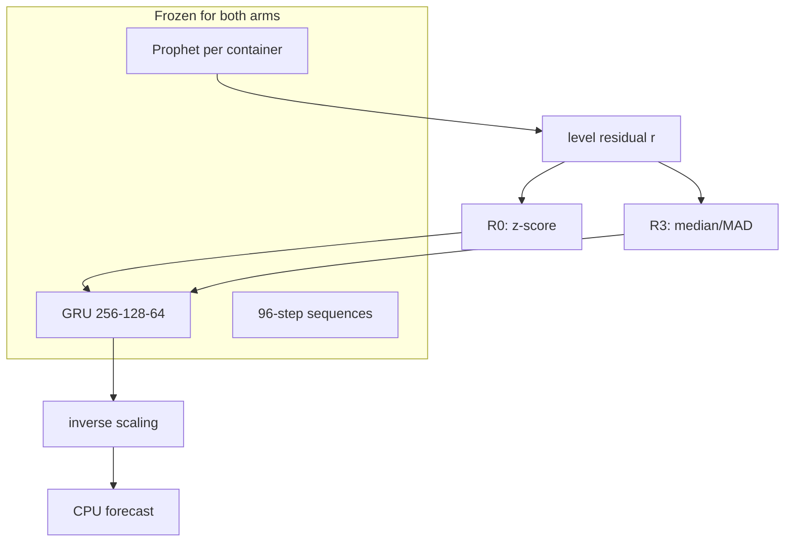

# Methodology

## Experimental design

Two-arm controlled comparison:

- **R0 (control):** Global z-score — frozen Hybrid baseline scaling.
- **R3 (treatment):** Global median/MAD — Stage 0 recommended robust scaling.

**Single controlled variable:** residual scaling transform and its inverse at inference.

## Frozen components

| Component | Specification |
|-----------|---------------|
| Cohort | 99 evaluable containers from `selected_containers.npy` |
| Data | `train_df.parquet`, `val_df.parquet`, `scalers.pkl` |
| Prophet | daily=True, weekly=False, per-container train fit |
| Residual | `r = cpu_scaled - prophet_pred` |
| GRU | GRU(256)→Dropout(0.2)→GRU(128)→Dropout(0.2)→GRU(64)→Dense(128,relu)→Dense(96) |
| Sequences | 96→96, feature=`residual_scaled`, chronological 80/20 internal val |
| Optimizer | Adam (lr=0.001 default) |
| Loss | MSE |
| Epochs | 100 max, early stopping patience=10 on val_loss |
| Batch | 64, shuffle=False |
| TF seed | None (matches frozen baseline) |
| Evaluation | Day-1 MAE/RMSE, Pearson, std ratio, peak metrics, bootstrap, Wilcoxon |

## Scaling formulas

**R0:** $\tilde{r} = (r - \mu_{train}) / \sigma_{train}$

**R3:** $\tilde{r} = (r - \mathrm{median}_{train}) / \mathrm{MAD}_{train}$

Statistics computed on **all train-period level residuals** (pooled across 99 containers). No validation leakage.

## Inference

GRU predicts $\hat{\tilde{r}}$ → inverse transform to level $\hat{r}$ → add Prophet → inverse MinMax to CPU %.

## Optimisation metrics (primary for this experiment)

- Best epoch, total epochs, train/val loss curves
- Final train/val loss, generalisation gap (best val − best train)
- Convergence speed (= best epoch)

## Statistical comparison

Paired per-container tests (R3 − R0):

- Bootstrap 95% CI (seed 12345)
- Wilcoxon signed-rank (α = 0.05)
- Cohen's d, fraction improved
- Practical significance threshold: 0.05% MAE

## Diagram

