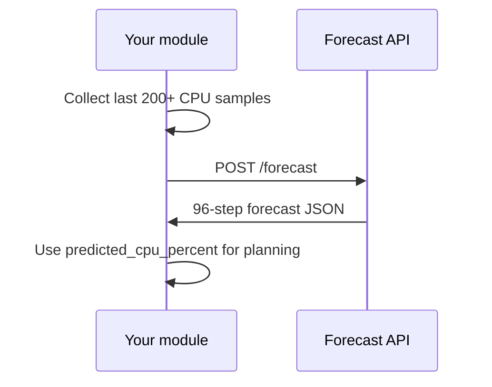

# Integration Guide

For other DracaSys module developers integrating CPU forecasting.

## Prerequisites

- Forecast service running (see [implementation/deployment.md](../implementation/deployment.md))
- Historical CPU data: **≥ 200** samples at **15-minute** intervals
- Container ID string (known IDs get better scaler consistency)

## 1. Start the service

```bash
cd forecast_service
pip install -r requirements.txt
python run.py
```

Verify:

```bash
curl http://localhost:8000/health
# {"status":"healthy","model_loaded":true,...}
```

## 2. Single forecast

**Endpoint:** `POST /forecast`

**Minimal request:**

```json
{
  "container_id": "c_1016",
  "historical_cpu": [12.5, 13.1, ...],
  "timestamps": ["2026-01-01T00:00:00+00:00", ...],
  "sampling_interval_minutes": 15,
  "prediction_horizon_steps": 96
}
```

**Response (success):**

```json
{
  "status": "success",
  "container_id": "c_1016",
  "metadata": {
    "model_version": "hybrid_v1",
    "processing_time_ms": 8421.5,
    "scaler_mode": "known",
    "history_steps_used": 200,
    "horizon_steps": 96,
    "sampling_interval_minutes": 15
  },
  "forecast": {
    "timestamps": ["2026-01-03T02:00:00+00:00", ...],
    "predicted_cpu_percent": [14.2, 14.5, ...],
    "prophet_component_percent": [13.8, 14.0, ...],
    "gru_residual_component_percent": [0.4, 0.5, ...]
  }
}
```

## 3. Client examples

See [examples.md](examples.md) for sample JSON files and client code in curl, Python, Java, and JavaScript.

## 4. Batch forecast

**Endpoint:** `POST /forecast/batch`

```json
{
  "requests": [
    { "container_id": "c_1016", "historical_cpu": [...], "timestamps": [...] },
    { "container_id": "c_9999", "historical_cpu": [...], "timestamps": [...] }
  ]
}
```

Max **50** requests per batch. Failed items return `"status": "error"` without failing the whole batch.

## 5. Common errors

See [errors.md](errors.md) for the full troubleshooting table.

| HTTP | Message | Fix |
|------|---------|-----|
| 422 | Insufficient history | Provide ≥ 200 steps |
| 422 | timestamps must be evenly spaced | Fix gaps in data |
| 422 | zero variance | Container idle/degenerate CPU |
| 400 | Unsupported sampling interval | Use 15 minutes |
| 503 | Model artifacts not loaded | Check artifacts path, restart service |

## 6. Integration pattern



## 7. Swagger

Interactive docs: **http://localhost:8000/docs**

OpenAPI JSON: **http://localhost:8000/openapi.json**

## 8. Production checklist

- [ ] Run behind HTTPS reverse proxy
- [ ] Set resource limits (Prophet is CPU/memory intensive)
- [ ] Monitor `/health` for orchestration
- [ ] Pin `hybrid_v1` artifact version in deployment
- [ ] Do not mount artifacts read-write

See [schemas.md](schemas.md) for full field definitions. Sample payloads: [examples.md](examples.md).
