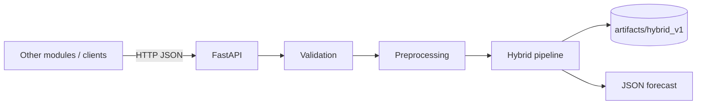

# Architecture

## Purpose

The forecast service exposes a **frozen Hybrid Prophet+GRU model** as a stateless REST API. Other DracaSys modules (deployment helper, anomaly detection, dashboard) call it to obtain 24-hour CPU forecasts without embedding ML code.

## Why a separate deployment project

Research code (`experiments/`, notebooks, training scripts) is optimised for reproducibility and experimentation. Production inference requires:

- Stable API contracts
- Clear error handling
- No accidental retraining
- Independent release cycle

This service lives entirely under `forecast_service/` and only reads artifacts from `artifacts/hybrid_v1/`.

## High-level diagram

## Components

| Layer | Path | Responsibility |
|-------|------|----------------|
| API | `app/api/` | HTTP routes, schemas, error mapping |
| Services | `app/services/` | Orchestration, artifact loading |
| Inference | `app/inference/` | Hybrid pipeline, GRU prediction |
| Preprocessing | `app/preprocessing/` | Validation, MinMax scaling |
| Prophet | `app/prophet/` | Per-request Prophet fit + forecast |
| Config | `app/config/` | Environment-based settings |
| Artifacts | `artifacts/hybrid_v1/` | Frozen model bundle (read-only) |

## Stateless design

Each request is independent:

1. Client sends historical CPU + timestamps
2. Service fits Prophet on that history (in-memory)
3. GRU weights are loaded once at startup
4. Response returned; no server-side history stored

## What this service does NOT do

- Train or fine-tune models
- Store time-series databases
- Authenticate users (add reverse proxy if needed)
- Schedule periodic forecasts (client responsibility)

See [system_design.md](system_design.md) for component details.
