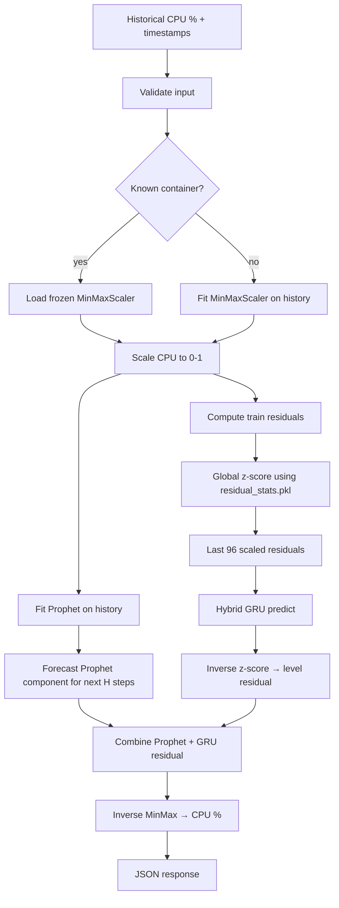

# Forecast Pipeline

End-to-end path from HTTP request to CPU forecast.

## Pipeline diagram



## Step-by-step

### 1. Input validation

- Minimum **200** history steps (matches production unseen-container policy)
- **15-minute** uniform spacing
- CPU in **[0, 100]** percent, finite values, non-zero variance
- Horizon **1–96** steps (default 96 = 24 hours)

### 2. CPU scaling (MinMax)

Maps real CPU % to `[0, 1]` for Prophet and GRU, consistent with training.

### 3. Prophet

- Fit on `(timestamp, cpu_scaled)` for all provided history
- Daily seasonality **on**, weekly **off** (frozen production config)
- Predict seasonal component for future timestamps

### 4. Residual computation

On training history:

```
residual = cpu_scaled - prophet_yhat
residual_scaled = (residual - res_mean) / res_std
```

`res_mean` and `res_std` are **global constants** from training (not per-request).

### 5. GRU input

Last **96** values of `residual_scaled` → tensor shape `(1, 96, 1)`.

### 6. GRU output

Model outputs **96** future scaled residuals; truncated to requested horizon.

### 7. Combine and denormalise

```
final_scaled = prophet_future + residual_level
final_cpu% = MinMaxScaler.inverse_transform(final_scaled)
```

Output clipped to `[0, 100]`.

## Timing

Typical single request: **5–30 seconds** (Prophet fit dominates). Batch requests run sequentially.

## Related docs

- [preprocessing.md](preprocessing.md)
- [prophet_pipeline.md](prophet_pipeline.md)
- [gru_pipeline.md](gru_pipeline.md)
